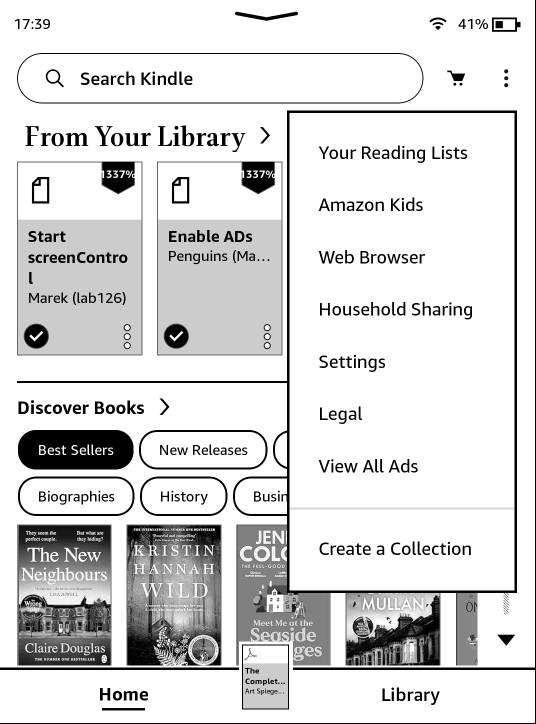
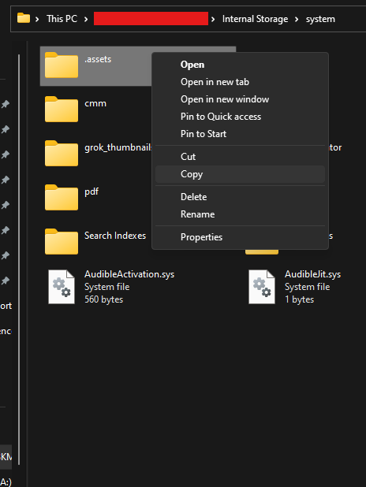
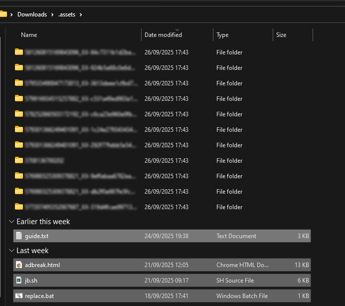
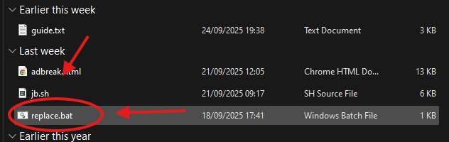
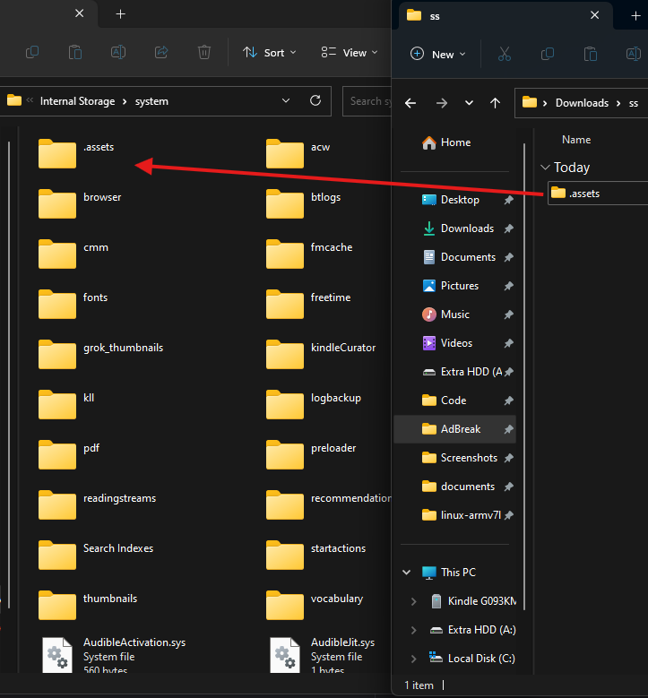
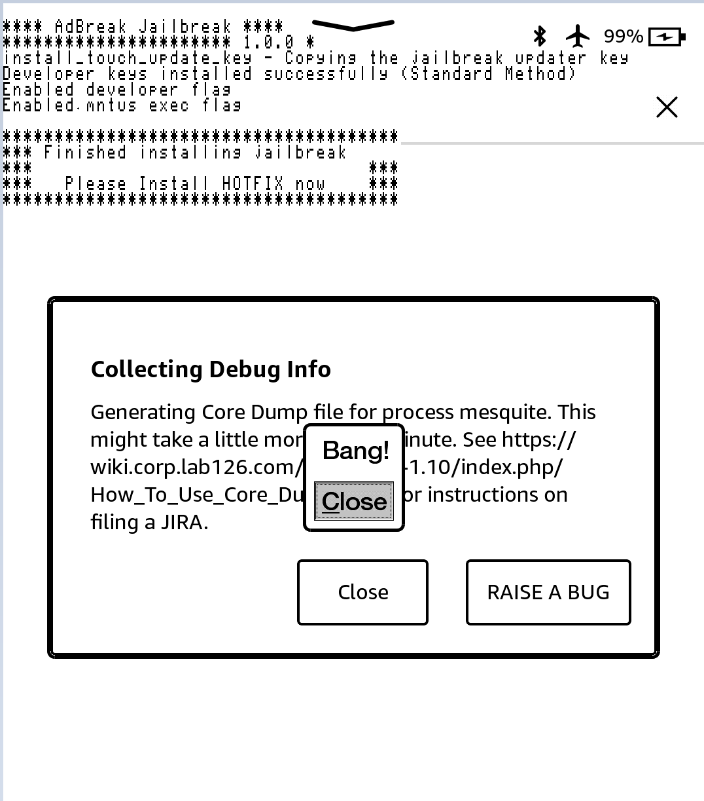

# AdBreak

> If I cannot do great things, I can do small things in a great way.
>  
> \- Martin Luther King, Jr.

AdBreak is a jailbreak released on 24/09/2025 by hhhhhhhhh.

It is based on [CVE-2012-3748](https://scarybeastsecurity.blogspot.com/2017/05/ode-to-use-after-free-one-vulnerable.html).

## Prerequisites

- A PC, Cable, Kindle.
- Unzipping Software (E.g., <a href="https://7-zip.org/">7-Zip</a>)
- A registered, ad-enabled, supported model and firmware, as you have been led here by the <b><a href="../../jailbreak-wizard.html">Jailbreaking Wizard</a></b>.
- You have read <a href="../">this overview</a> and <a href="../prevent-auto-update/">filled the device</a>, if applicable
- A Wi-Fi connection.

> [!INFO]
> If you face any difficulty in following these guides, please navigate to the [troubleshooting](#troubleshooting) section, and/or make a ticket in the KindleModding Discord support forums/Community Reddit. It also includes details on how you could possibly re-enable ads on a kindle which does not have them at present.

## Installation Guide

    

        <button id="prev">Previous Step</button>
        
        <button id="next">Next Step</button>
    

    

        

            <h2>Before Jailbreaking...</h2>
            

                

                    <b>Warning!</b> 
                    Jailbreaking often involves connecting to the Internet.
                    Before beginning <b>any</b> jailbreaking process, please remember to <a href="../prevent-auto-update/">fill up your Kindle </a> as to avoid ruining the jailbreak mid-process. Additionally, please ensure <b>you have read <a href="../">this</a></b> before you start.
                

                
If you have done the above, please commence to the next step.

            

        

        

            <h2>Download the latest AdBreak release:</h2>
            

                <a href="https://github.com/KindleModding/AdBreak/releases/latest/download/adbreak.zip" class="button">Download</a>
            

        

        

            <h2>Download Ads</h2>
            

                
Leave your kindle for a while, connected to the internet, so it can download advertisements.   If you press the lock button, an advertisement should be displayed.   If advertisements aren't being downloaded after a while, a factory reset may help.

            

        

        

            <h2>Aeroplane Mode</h2>
            

                
Once you have verified ads are displayed on the lockscreen, enable airplane mode.

                 
            

        

        

            <h2>View all ads</h2>
            

                
Click on the top right menu and select "View all ads", which should display multiple "special offers".

                
            

        

        

            <h2>Copy .assets</h2>
            

                
Plug in the Kindle, open the system folder and copy the ".assets" folder to your computer.

                
            

        

        

            <h2>Unzip AdBreak</h2>
            

                
Unzip the previously downloaded AdBreak, and place the extracted contents within the ".assets" folder located on your computer.

                
            

        

        

            <h2>Run The Replace Script</h2>
            

                

                    
Windows:

                    
Double-click on "replace.bat" to run it.

                

                

                    
MacOS/Linux:

                    
Run <code> find . -name 'details.html' -exec cp adbreak.html {} \;</code> using a terminal.

                

                
            

        

        

            <h2>Replace Kindle .assets</h2>
            

                
Delete the original kindle <code>.assets</code> and replace it with your on-PC modified copy.

                
            

        

        

            <h2>Jailbreak!</h2>
            

                
Unplug, click on an ad and go through the popups, once you click Close on "Bang!", the jailbreak script should run.

                

                    You can safely ignore any "application error" popups, they are irrelevant.
                

                
            

        

        

            <h2>After Jailbreaking...</h2>
            

                

                    <b>What's Next?</b> 
                    Commence to the <a href="../whats-next">What's Next</a> section to read about installing scriptlets, homebrew, and KOReader. Read the <b>whole section</b> thoroughly.
                

                

                    You may now <b>delete</b> any filler files. Updates have been automatically blocked for you.  
                    Before you do this, also <b>remove any existing update files with a <code>.bin</code> extension</b>, if they exist in the Kindle's root.
                

                
Have fun! :)

            

        

    

    

        <button id="prev">Previous Step</button>
        
        <button id="next">Next Step</button>
    

## Troubleshooting

### Common Issues

- Can't find the system folder:
    - On mass storage kindles, **if you cannot see the `system` folder**, you will have to navigate to the path manually, or follow [this](https://web.archive.org/web/20250928174006/https://kb.blackbaud.com/knowledgebase/Article/41890) guide to see protected system folders. 
- "Bang!" shows but the jailbreak doesn't run:
    - Check the .assets folder on the Kindle. "jb.sh" and "patchedUks.sqsh" must be in there.

<h3 id="enabling-ads">Enabling Ads</h3>

> [!NOTE]
> Ads can be disabled afterwards - enabling them is **NOT** permanent

- Switch account region  
   - Go to Manage Your Content and Devices → Preferences → Country/Region Settings → Change.  
   - Select one of: US, UK, DE, FR, IT, ES, JP, CN, AU  
   - Use valid details (address, phone, email).
- Add payment method  
   - Set a default credit card and billing address matching the chosen region.  
   - No charge should occur.
- Enable special offers  
   - In your Amazon account, turn on Special Offers for your Kindle.
- Sync kindle  
   - Connect to Wi-Fi, eventually ads will appear on lockscreen.
   
## Special Thanks To
- [Chris Evans (@scarybeasts)](https://x.com/scarybeasts) for a lot of the exploit code
- [Hackerdude](https://hackerdude.tech) for the modified JB script.
- Ceoz: Enable-ad findings
- [Penguins184](https://ko-fi.com/penguins186): This guide
