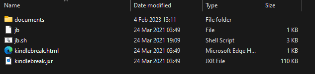

# KindleBreak
[KindleBreak](https://www.mobileread.com/forums/showthread.php?t=338268) is jailbreak utilising the [`KindleDrip`](https://medium.com/realmodelabs/kindledrip-from-your-kindles-email-address-to-using-your-credit-card-bb93dbfb2a08) webkit exploit.

## Prerequisites
- Please check that your Kindle is [compatible](../../kindle-models) with KindleBreak
- You will also need a PC

> [!WARNING]
> KindleBreak will **NOT** work on firmware `5.12.2.2`

## Jailbreaking Your Kindle
1. On your Kindle, enable `Airplane Mode` if it isn't already on
2. Download [`jb-kindlebreak.zip`](https://storage.gra.cloud.ovh.net/v1/AUTH_2ac4bfee353948ec8ea7fd1710574097/mr-public/Touch/jb-kindlebreak.zip) `MD5: 0215C36CC1E3AD8136A67DAEBE369452`
3. Plug your Kindle into your computer
4. Extract the `jb-kindlebreak.zip` file to the root of your Kindle as so:

5. Download [`file__0.localstorage`](./file__0.localstorage)
6. Place it in the following folder in your Kindle: `/.active_content_sandbox/browser/resource/LocalStorage/` (create the folders if they aren't already there, replace the existing file)
7. Eject and unplug your Kindle
8. Open the `Experimental Browser` of the Kindle
9. The browser should freeze, crash and then after some time (up to 5 minutes) the Kindle will reboot. After this, it should show an error popup with the message `Application Error` or `Collecting Debug Info`
10. The device is now in a jailbroken state

You are now ready to check the `Post Jailbreak` section for what to do now.

<a class="button button-purple" href="../../post-jailbreak/">Post Jailbreak</a>

## Credits
- Original guide written by [Neon](https://www.mobileread.com/forums/member.php?u=329187)
- [KindleBreak](https://www.mobileread.com/forums/showthread.php?t=338268) created by [tryol](https://www.mobileread.com/forums/member.php?u=317940)