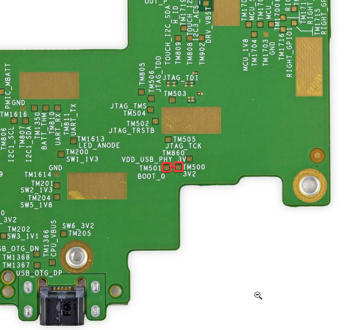

# KV

<blockquote class="warning">
Popcorn is quite a sophisticated jailbreak method and requires prior electronics experience. It is not recommended to use Popcorn unless you have prior electronics experience *especially* if a software jailbreak such as `WatchThis` is available for it.
</blockquote>

<blockquote class="info">
Make sure you have followed the [initial Popcorn instructions](./)
</blockquote>

<blockquote class="warning">
The Kindle Voyage (KV) supports `WatchThis` on its latest firmware. It is not recommented that you use `Popcorn` instead of `WatchThis`
</blockquote>

## Performing the Jailbreak
1. Tear down the `KV` up to `step 5` as described [here](https://www.ifixit.com/Guide/Kindle+Voyage+Screen+Replacement/37464)
2. Remove the motherboard by unscrewing it from the chassis and **gently** disconnecting all the cables and the battery
3. Connect a wire between test pads `TM501` and `TM500` as shown in this picture: 
4. Whilst those points are connected, hard reboot the Kindle by holding down the power button for `15 seconds`
5. Plug the Kindle into your PC

If everything went well, the device is now in `SDP Mode` and ready to be flashed

## Windows
On Windows, simply locate the folder you extracted earlier, double click on `MFGTool.exe` to run it and then click on `Start` and wait for it to complete.

You are now ready to check the `Post Jailbreak` section for what to do now.

[Post Jailbreak](../../post-jailbreak/){: .button .button-purple}

## Linux
On Linux, open a new terminal and navigate to the folder which contains the folder named `imx_usb_loader`

If you run `ls` it should show the `imx_usb_loader` folder, run the following command:
~~~bash
sudo imx_usb -c imx_usb_loader/wario
~~~
And wait for it to complete.

You are now ready to check the `Post Jailbreak` section for what to do now.

[Post Jailbreak](../../post-jailbreak/){: .button .button-purple}

## Credits
- Original guide written by [Neon](https://www.mobileread.com/forums/member.php?u=329187)
- [Popcorn](https://www.mobileread.com/forums/showthread.php?t=345655) created by [katadelos](https://www.mobileread.com/forums/member.php?u=308426)
- Original Test Point Image source - [Neon](https://www.mobileread.com/forums/member.php?u=329187)?