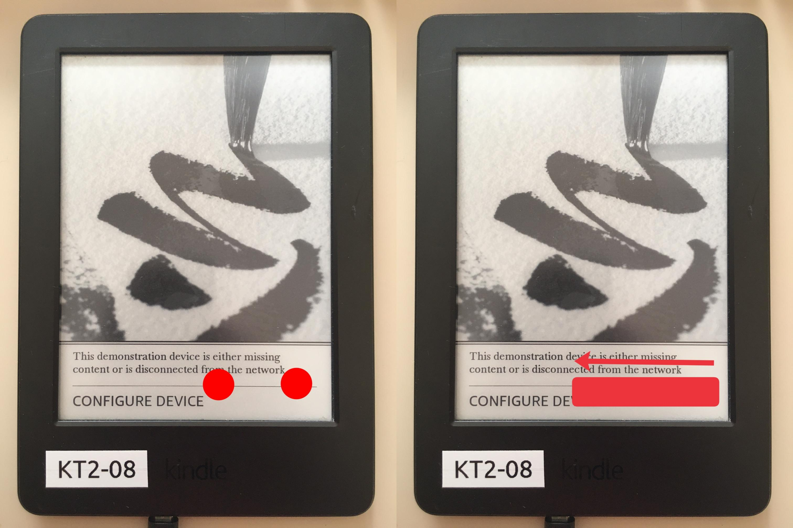

# WatchThis
[WatchThis](https://www.mobileread.com/forums/showthread.php?t=346037) is a jailbreak utilising a `demo payload` exploit.

## Prerequisites
- Please check that your Kindle is [compatible](../kindle-models) with WatchThis
- You will also need a PC

<blockquote class="warning">
WatchThis will erase all the data on your Kindle, so be sure to back up any local files you wish to keep
</blockquote>

## Jailbreaking Your Kindle
### Initial setup
1. Factory reset your Kindle
2. On the language selection screen, select `en_GB` or `English (United Kingdom`).
3. Skip Wi-Fi registration by selecting any network and then backing out
4. Type `;enter_demo` into the Kindle's searchbar an click enter
5. Reboot the Kindle by holding down the button and selecting the `reboot` option when it appears
6. The device should now boot into demo mode, if it doesn't, check the [Troubleshooting](#troubleshooting) section
7. Skip WiFi setup and enter fake information when prompted
8. Skip searching for a demo payload
9. Select the `standard` demo type
10. Press `Done` at the "sideload content" prompt
11. Once that is done, you can byass the `misconfiguration` error using the following gesture:

(tap with two fingers, then swipe left)
12. In the searchbar, type `;demo` and click enter
13. Select the "sideload content" option

### Sideloading the content
1. Connect the Kindle to your PC
2. On the Kindle, create a `.demo` directory at the root of the device
3. Download [`watchthis-jailbreak-r03.zip`](https://mega.nz/file/2ahlQKZS#jXyYLEp9rvRQCOzv7LNYBF-9fOfPhpigaLZMHZkN7fg)
4. Extract this zip onto your computer (**NOT the Kindle**)
5. Locate the appropriate `[YOUR_DEVICE]-[YOUR_FIRMWARE].zip` file, and copy it to `.demo/` (**DO NOT EXTRACT IT**)
6. Copy the `demo.json` file to `.demo/`
7. Create a folder called `goodreads` in `.demo`, leave it empty
8. Now eject and unplug your Kindle, and then select `Done` at the prompt to install the jailbreak

    <blockquote class="warning">
    If an `application error` occurs, hold down the power button for 15 seconds or longer to `hard-reboot` the device, and then enter demo mode again and select `sideload content`, do not copy the files again.
</blockquote>

9. Exit demo mode
10. **ONLY** if you are jailbreaking a `KT2` or `PW2` press the store button. For all other models, enter `;dsts` into the search bar
11. Select `Help & User Guides` and then select `Get Started`
12. The device will now reboot into a jailbroken state

### WatchThis-Specific Hotfix

<blockquote class="note">
WatchThis is unique in the sense that its own `Hotfix` must be installed before proceeding with other `Post Jailbreak` items
</blockquote>

1. Type `;uzb` into the search bar of your Kindle and click enter
2. Connect the Kindle to your PC
3. Copy the `update_hotfix_watchthis_custom.bin` from the WatchThis zip you extracted during setupto the root of your Kindle
4. Eject and unplug the Kindle
5. Enter `;dsts` into the search bar of the Kindle and click enter
6. Select `Update Your Kindle`

You are now ready to check the `Post Jailbreak` section for what to do now.

[Post Jailbreak](../../post-jailbreak/){: .button .button-purple}

# Troubleshooting
If you had any issue with the above steps...

## Alternative Demo Mode entry method
1. Plug the Kindle into your PC
2. Create an empty file named `DONT_CHECK_BATTERY` at the root of your Kindle
3. Activate demo mode by typing `;demo` into the search bar and clicking enter
4. Continue from `step 7` of `Initial setup`

## Resetting whilst in Demo Mode
If you need to reset your device whilst in demo mode
1. Enter `;uzb` in the search bar and click enter
2. Plug the Kindle into your PC
3. Create an empty file at the root of the Kindle called `DO_FACTORY_RESTORE`
4. Reboot the Kindle

## Secret Gesture Video
[this video](https://www.youtube.com/watch?v=JzuIGbGPpig) shows how to perform the misconfiguration bypass gesture

## Credits
- Original guide written by [Neon](https://www.mobileread.com/forums/member.php?u=329187)
- [WatchThis](https://www.mobileread.com/forums/showthread.php?t=346037) created by [katadelos](https://www.mobileread.com/forums/member.php?u=308426)