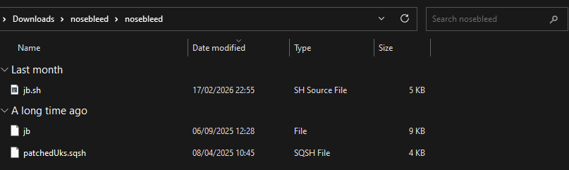
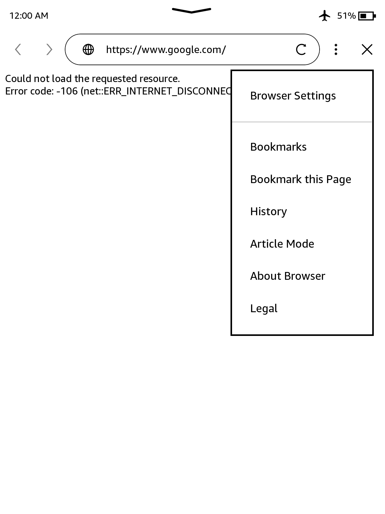
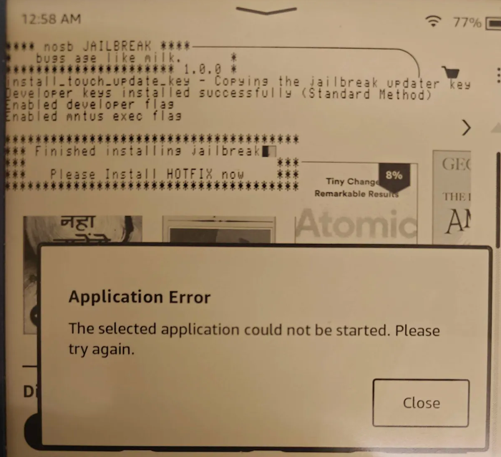

# Nosebleed

> Unc orders you [penguins] to spell
>  
> \- hhhhhhhhh

Nosebleed is a jailbreak released on 02/03/2026 by hhhhhhhhh.

## Prerequisites

- You will need a PC & Cable
- For firmware versions 5.16.4 - 5.18.6, supported models are PW5, PW5SE, KT5, KOA3 and KOA3W32C
- If you have a blacklisted PW6 or KT6, it may work up to (including) 5.17.1.0.4

<blockquote class="note">
    This works on blacklisted Kindles!
</blockquote>

## Installation Guide

    

        <button class="btn btn-orange" id="prev">Previous Step</button>
        
        <button class="btn btn-green" id="next">Next Step</button>
    

    

        

            <h2>Download the latest Nosebleed release:</h2>
            

                <a href="./nosebleed.zip" class="button">Download</a>
                

                    This will only work on some Kindles (listed in the prerequisites section.)
                

            

        

        

            <h2>Prevent updates</h2>
            

                
Ensure your Kindle is filled and there is no space to automatically update. The jailbreak process involves connecting to the Internet.

                <a href="../prevent-auto-update" class="button">Preventing updates</a>
            

        

        

            <h2>Extract & Copy</h2>
            

                
Plug in the Kindle, Extract <code>nosebleed.zip</code> on your PC, and copy the three files within to your Kindle's root (top folder when connected).

                 
            

        

        

            <h2>Open Browser</h2>
            

                
Click on the top right menu and open the Browser.

                
            

        

        

            <h2>Navigate to Nosebleed's Webpage</h2>
            

                
Navigate to <code>https://kindlemodding.org/nosb</code>.

                
            

        

        

            <h2>Jailbreak!</h2>
            

                
Press the L on Jeff Bezos' forehead, and Bang! <b>Application Errors are expected and may be ignored!</b>

                
            

        

    

    

        <button class="btn btn-orange" id="prev">Previous Step</button>
        
        <button class="btn btn-green" id="next">Next Step</button>
    

## Special Thanks To

- [Hackerdude](https://hackerdude.tech/) for the modified JB script.
- [Penguins184](https://ko-fi.com/penguins186/): This guide