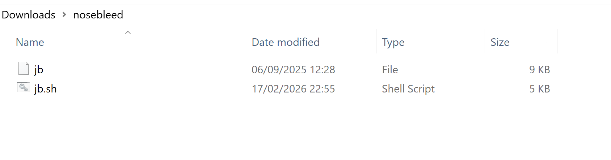
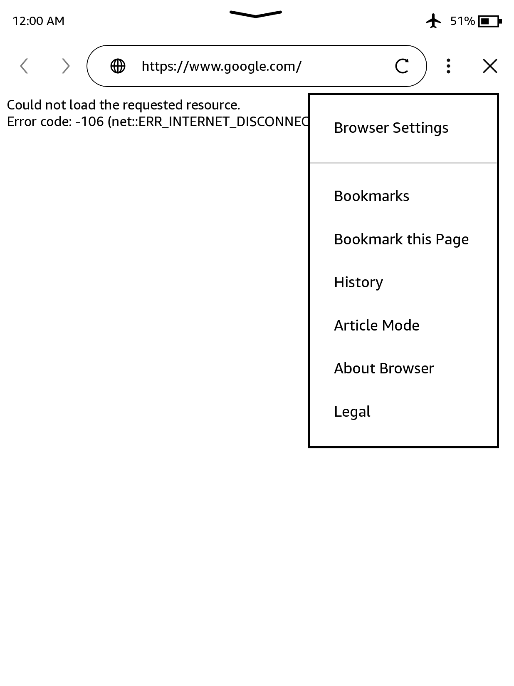
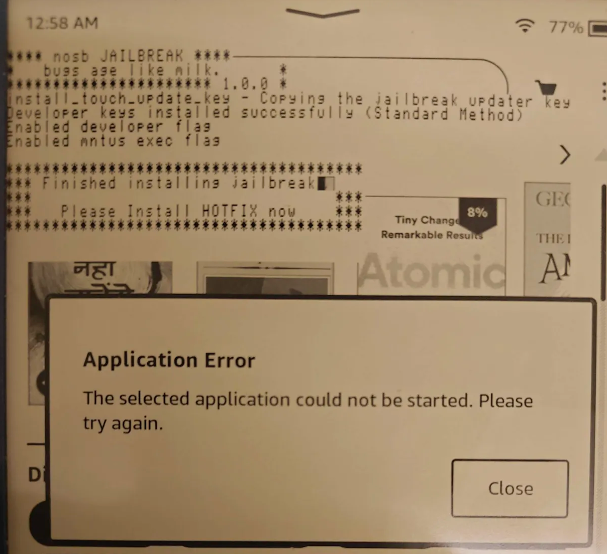

# Nosebleed

> Success is a process, a quality of mind and way of being, an outgoing affirmation of life.
>  
> \- Alex Noble

Nosebleed is a jailbreak released on 02/03/2026 by hhhhhhhhh.

## Prerequisites

- A PC, Cable, Kindle.
- Unzipping Software (E.g., <a href="https://7-zip.org/">7-Zip</a>)
- A supported model and firmware, as you have been led here by the <b><a href="/jailbreak-wizard.html">Jailbreaking Wizard</a></b>.
- You have read <a href="/jailbreaking">this overview</a> and <a href="/jailbreaking/prevent-auto-update/">filled the device</a>, if applicable
- A Wi-Fi connection.

<blockquote class="note">
    If you face any difficulty in following these guides,make a ticket in the KindleModding Discord support forums/Community Reddit.
</blockquote>

## Installation Guide

    

        <button id="prev">Previous Step</button>
        
        <button id="next">Next Step</button>
    

    

        

            <h2>Before Jailbreaking...</h2>
            

                

                    <b>Warning!</b> 
                    Jailbreaking often involves connecting to the Internet.
                    Before beginning <b>any</b> jailbreaking process, please remember to <a href="/jailbreaking/prevent-auto-update/">fill up your Kindle </a> as to avoid ruining the jailbreak mid-process. Additionally, please ensure <b>you have read <a href="/jailbreaking">this</a></b> before you start.
                

                
If you have done the above, please commence to the next step.

            

        

        

            <h2>Download the latest Nosebleed release:</h2>
            

                <a href="./nosebleed.zip" class="button">Download</a>
            

        

        

            <h2>Extract & Copy</h2>
            

                
Plug in the Kindle, Extract <code>nosebleed.zip</code> on your PC, and copy the three files within to your Kindle's root (top folder when connected).

                 
            

        

        

            <h2>Open Browser</h2>
            

                
Click on the top right menu and open the Browser.

                
            

        

        

            <h2>Navigate to Nosebleed's Webpage</h2>
            

                
Navigate to <code>https://kindlemodding.org/nosb</code>.

                
            

        

        

            <h2>Jailbreak!</h2>
            

                
Press the L on Jeff Bezos' forehead, and Bang! <b>Application Errors are expected and may be ignored!</b>

                
            

        

        

            <h2>Done</h2>
            

                
Once the jailbreak has completed, continue to the post-jailbreak stage.

            

        

    

    

        <button id="prev">Previous Step</button>
        
        <button id="next">Next Step</button>
    

## Special Thanks To

- [Hackerdude](https://hackerdude.tech/) for the modified JB script.
- [Penguins184](https://ko-fi.com/penguins186/): This guide