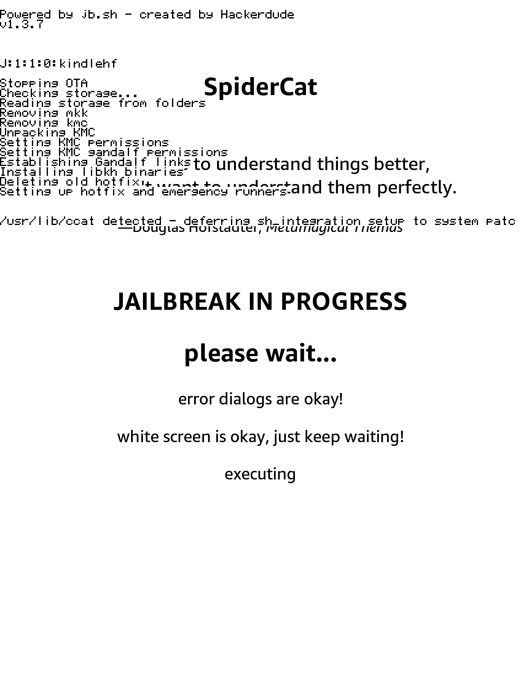

# SpiderCat

> I would like to understand things better, but I don't want to understand them perfectly.
>  
> \- Douglas Hofstadter

SpiderCat is a jailbreak released on 01/09/26 by [sparklerfish](https://ko-fi.com/sparklerfish).

## Prerequisites

- A Kindle
- A supported model and firmware, as you have been led here by the <b><a href="../../jailbreak-wizard.html">Jailbreaking Wizard</a></b>.
- You have read <a href="../">this overview</a> and <a href="../prevent-auto-update/">filled the device</a>, if applicable
- A Wi-Fi connection.

> [!INFO]
> If you face any difficulty in following these guides, please navigate to the [troubleshooting](#troubleshooting) section, and/or make a ticket in the KindleModding Discord support forums/Community Reddit.

## Installation Guide

    

        <button id="prev">Previous Step</button>
        
        <button id="next">Next Step</button>
    

    

        

            <h2>Before Jailbreaking...</h2>
            

                

                    <b>Warning!</b> 
                    Jailbreaking often involves connecting to the Internet.
                    Before beginning <b>any</b> jailbreaking process, please remember to <a href="../prevent-auto-update/">fill up your Kindle </a> as to avoid ruining the jailbreak mid-process. Additionally, please ensure <b>you have read <a href="../">this</a></b> before you start.
                

                
If you have done the above, please commence to the next step.

            

        

        

            <h2>Download the SpiderCat book</h2>
            

                
You may choose to either download and sideload SpiderCat via USB from your computer, or download it directly from your Kindle's web browser.

                
If USB sideloading via computer, <b>go to Step 3</b>.

                
If downloading via Kindle browser, <b>go to Step 4</b>.

            

        

        

            <h2>Sideloading SpiderCat via computer</h2>
            

                
If downloading via Kindle browser, <b>skip to Step 4</b>.

                
Download SpiderCat from the following link and place in the Kindle's "documents" folder:  <a href="https://kindlemodding.org/spidercat/spidercat.azw3">Download SpiderCat</a>

                
            

        

        

            <h2>Downloading SpiderCat via Kindle browser</h2>
            

                
If you sideloaded via USB, <b>skip to Step 5</b>.

                
On your Kindle, open the <b>Web Browser</b> and navigate to the following URL and download SpiderCat:  <code>https://kindlemodding.org/spidercat</code>

                
            

        

        

            <h2>Open the Book from your Library</h2>
            

                
The SpiderCat book should now appear in your library. You may or may not see cover art, depending on your device and firmware.

                

                    Do <b>not</b> disable Wi-Fi at this point. It is required until the final step of the jailbreak is completed.
                

                 
            

        

        

            <h2>Jailbreak!</h2>
            

                
Wait for the book to load. You may only see a blank page for several seconds.

                
Continue waiting after the page appears. After several more seconds, text will begin to flow down from the top of the screen.

                

                    You can safely ignore any "application error" popups, they are irrelevant.
                

                
            

        

        

            <h2>Restart and Done!</h2>
            

                
When the jailbreak script completes, a "Restarting GUI" screen will appear.  This may take several minutes to bring you back to your home screen, and a white screen is normal during this process. Then, your device will be in a jailbroken state.

                
            

        

        

            <h2>After Jailbreaking...</h2>
            

                

                    <b>What's Next?</b> 
                    Commence to the <a href="../whats-next">What's Next</a> section to read about installing scriptlets, homebrew, and KOReader. Read the <b>whole section</b> thoroughly.
                

                

                    You may now <b>delete</b> any filler files. Updates have been automatically blocked for you.  
                    Before you do this, also <b>remove any existing update files with a <code>.bin</code> extension</b>, if they exist in the Kindle's root.
                

                
Have fun! :)

            

        

    

    

        <button id="prev">Previous Step</button>
        
        <button id="next">Next Step</button>
    

## Troubleshooting

### Common Issues

- "Restarting GUI" is on the screen for >=10 minutes
    - Restart your kindle by holding the physical power button for a few seconds, then press "Restart" on the screen.
- Nothing happens after first opening the book
    - Ensure that you have a wifi connection when opening the book. If it still doesn't work, join the discord server for support.
   
## Special Thanks To
- fabrissou for sharing the entry point
- [Penguins](https://ko-fi.com/penguins186) for collaborating on the initial process and beta testing
- [ava](https://ko-fi.com/yubaix) for discovering the privesc and beta testing
- Marek for improving the exploit implementation and beta testing
- All beta testers: ava, Penguins, Marek, presidentporpoise
