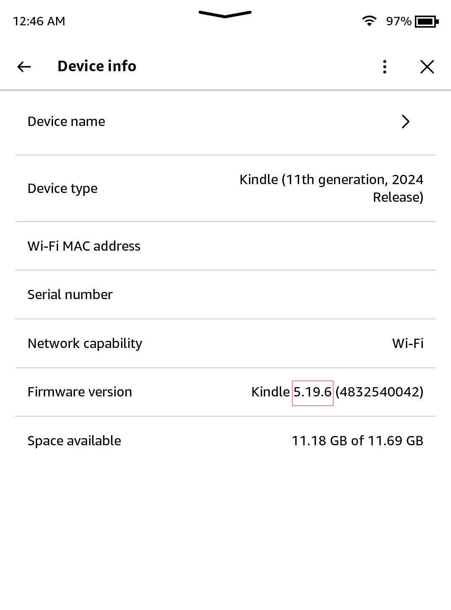
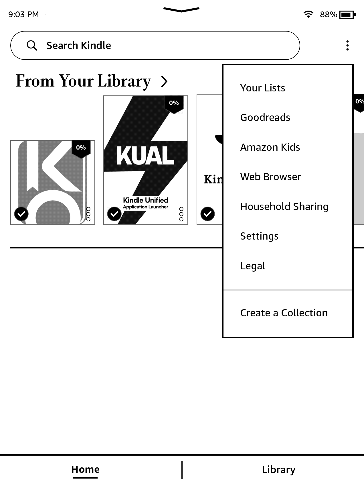
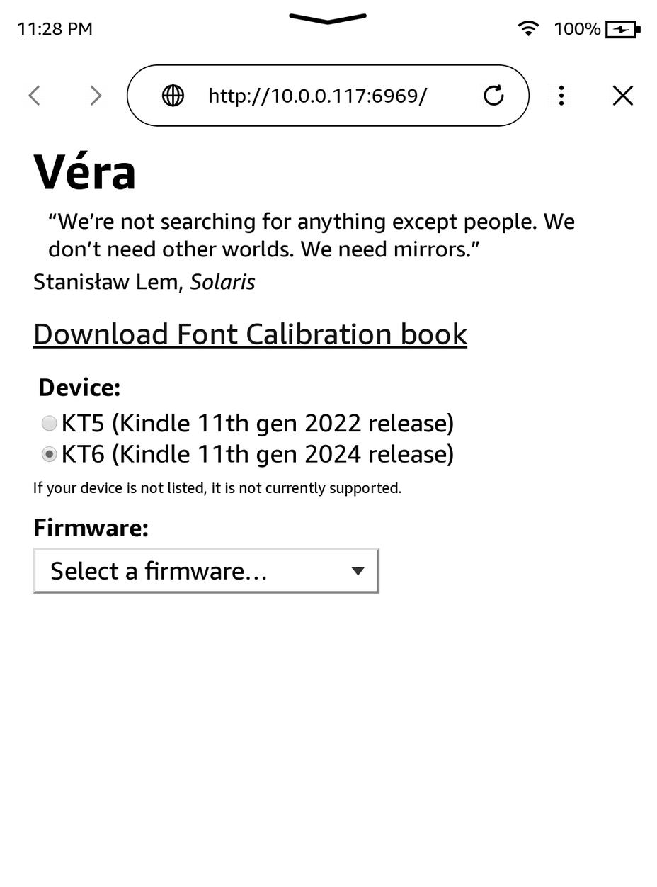
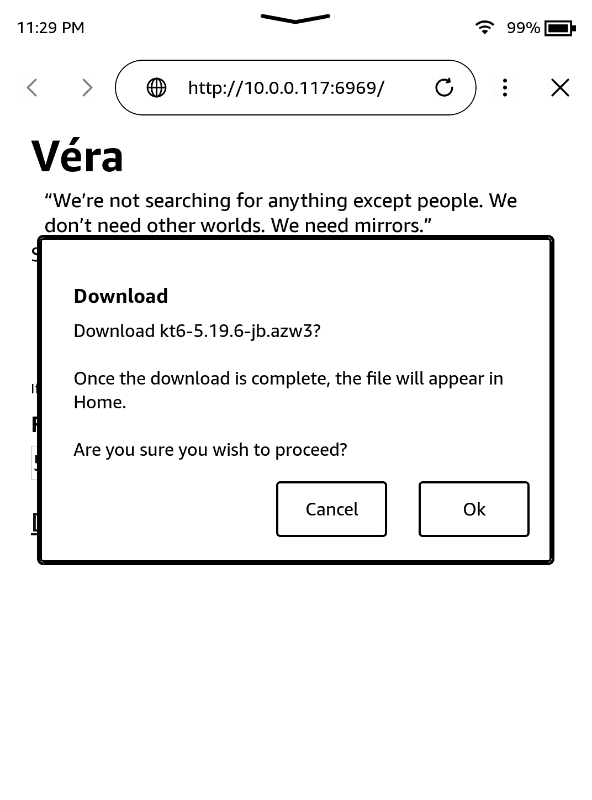
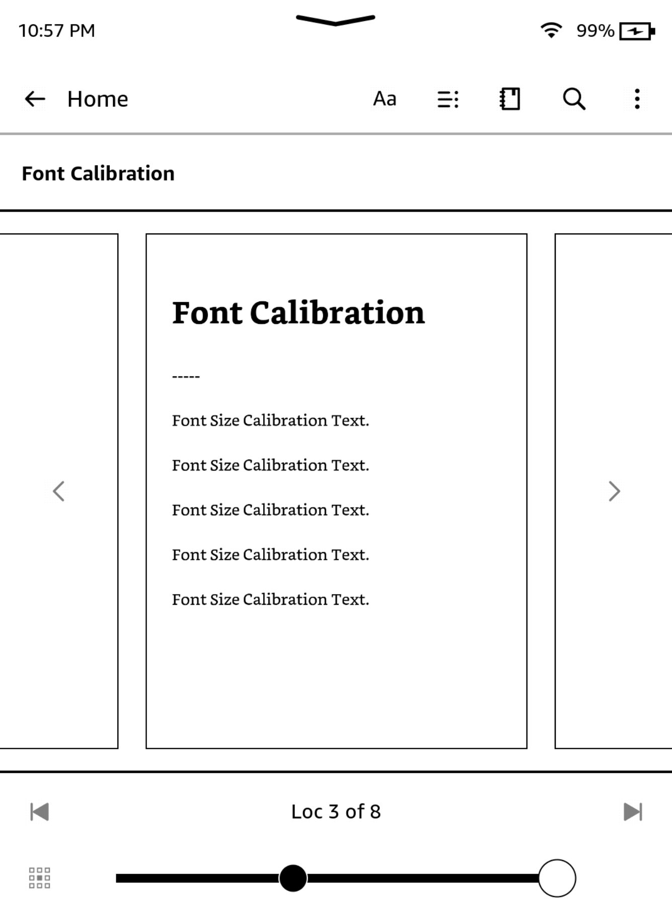
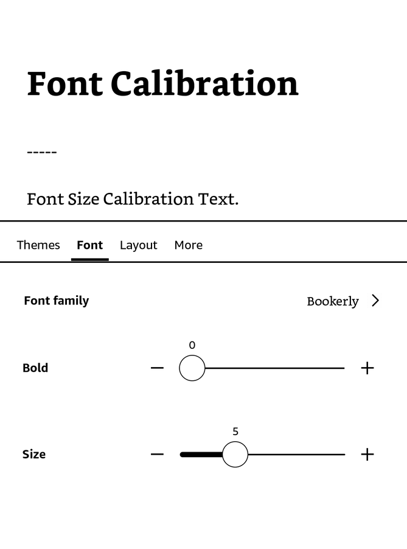
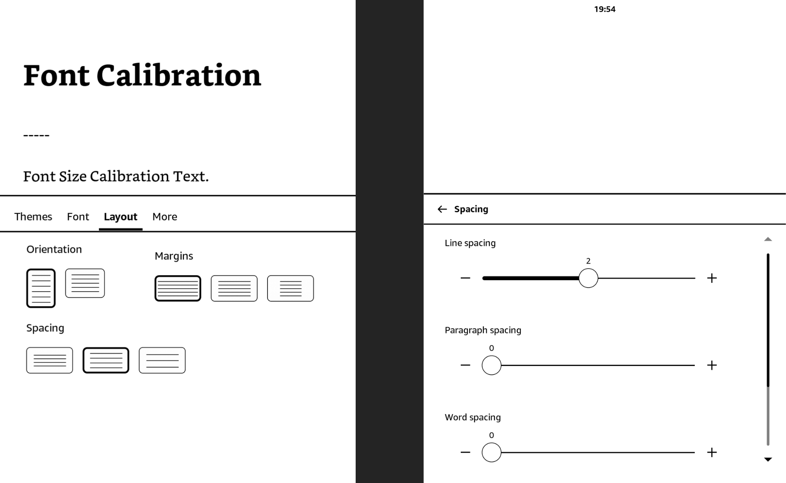
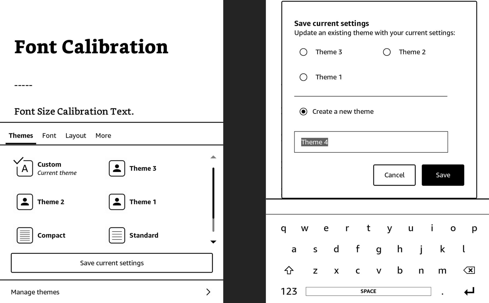

# Véra

> We’re not searching for anything except people. We don’t need other worlds. We need mirrors.
>  
> \- Stanisław Lem

Véra is a jailbreak released on 10/08/26 by [Ava](https://ko-fi.com/yubaix).

It will be ported to `KS3(NFL)` and `KSC firmwares` <=5.19.6 in the future.

## Prerequisites

- A Kindle
- A supported model and firmware, as you have been led here by the <b><a href="/jailbreak-wizard.html">Jailbreaking Wizard</a></b>.
- You have read <a href="/jailbreaking">this overview</a> and <a href="/jailbreaking/prevent-auto-update/">filled the device</a>, if applicable
- A Wi-Fi connection.

> [!INFO]
> If you face any difficulty in following these guides, please navigate to the [troubleshooting](#troubleshooting) section, and/or make a ticket in the KindleModding Discord support forums/Community Reddit.

## Installation Guide

    

        <button id="prev">Previous Step</button>
        
        <button id="next">Next Step</button>
    

    

        

            <h2>Before Jailbreaking...</h2>
            

                

                    <b>Warning!</b> 
                    Jailbreaking often involves connecting to the Internet.
                    Before beginning <b>any</b> jailbreaking process, please remember to <a href="/jailbreaking/prevent-auto-update/">fill up your Kindle </a> as to avoid ruining the jailbreak mid-process. Additionally, please ensure <b>you have read <a href="/jailbreaking">this</a></b> before you start.
                

                
If you have done the above, please commence to the next step.

            

        

        

            <h2>Note your device's firmware version</h2>
            

              
On your Kindle, open the device info menu. (<code>3 Dots → Settings → Device options → Device info </code>)

                
Note down your exact firmware version for later. The specific value should be the one after "Kindle" with multiple numbers and dots between each number.

                

                    The specific value should be the one after "Kindle" with multiple numbers and dots between each number.
                

                
                
Exit out of the menu by clicking the X in the top right.

            

        

        

            <h2>Navigate to your Kindle's browser.</h2>
            

              
On your Kindle, open the <b>Web Browser</b> (<code>3 Dots → Web Browser</code>)

                
Then, navigate to the following URL:

                
<code>https://vera.tene7.com</code>

                
            

        

        

            <h2>Select Model + Enter Firmware</h2>
            

                
Once you are on the website, choose your device from the selectable options if prompted.

                
Then, select your firmware from the dropdown box.

                

                    If your firmware does not appear in the dropdown box, but is above 5.17 and below 5.19.6, it is recommended to try the nearest firmware listed below your current firmware. This is not guaranteed to work, and it is recommended to join the discord server for support if this occurs.
                

                 
            

        

        

            <h2>Confirm Download + Exit Browser</h2>
            

                
If the previous step was done correctly, some highlighted text containing "Download" should appear."

                
Click the text, then click "Ok" to confirm the download.

                
After downloading the book, click the "Download Font Calibration Book" and confirm the download for that as well.

                 
                
After downloading, quit the browser by hitting the X in the upper right corner of the browser.

                

                    Do <b>not</b> disable Wi-Fi at this point. It is required until the final step of the jailbreak is completed.
                

            

        

        

            <h2>Enter "Aa" Menu</h2>
            

                
After closing the browser, click the "Font Calibration" book in your library.

                
Tap the top of the screen. An overlay should appear. In this overlay, click "Aa".

                
            

        

        

            <h2>Modify font values</h2>
            

                
Select the "Font" menu at the bottom.

                
Set the "Font Family" to Bookerly. Set "Bold" to 0. Set "Size" to the maximum possible value.

                
Your screen should match the image below after making these changes.

                
            

        

        

            <h2>Modify line spacing value</h2>
            

                
Select the "Layout" menu at the top, or the "Spacing" option if it appears.

                
If you clicked the "Layout" menu at the top, select the medium option for "Spacing" (left image).

                
If you clicked the "Spacing" option at the bottom, set "Line Spacing" to 2 (right image), then tap the arrow in the top left of the spacing menu.

                
            

        

        

            <h2>Creating a theme</h2>
            

                
Select the "Themes" menu at the top, or the "Spacing" option if it appears.

                
Click "Save current settings" and then click "Save" again to save as a theme.

                
Then, exit out of the book by tapping the top left corner of the screen 3 times.

                 <!-- i'm starting to like this split technique lol -->
            

        

        

            <h2>Jailbreak!</h2>
            

                
After closing the book, click the "Véra" book in your library.

                
After a few seconds, some text should flow from the top left of your screen, and a "RESTARTING GUI" screen should pop up.

                

                    You can safely ignore any "application error" popups, they are irrelevant.
                

                
            

        

    

    

        <button id="prev">Previous Step</button>
        
        <button id="next">Next Step</button>
    

## Troubleshooting

### Common Issues

- "Restarting GUI" is on the screen for >=10 minutes
    - Restart your kindle by holding the physical power button for a few seconds, then press "Restart" on the screen.
- Nothing happens after first opening the book
    - Ensure that steps 3-4 were followed exactly. If it still doesn't work, join the discord server for support.
   
## Special Thanks To
- Perplexity for a lot of tooling advice while creating this jailbreak, as well as motivating me to start creating one.
- [sparklerfish](https://give.thetrevorproject.org/give/63307#!/donation/checkout) for creating the website used in the jailbreak, as well as collaborating with me on finding the initial exploit.
- [scam.net](https://ko-fi.com/scamdotnet1) for coming up with the initial idea for the website.
- Lastcandy for being an exemplary beta tester who helped find a bug that would have gone otherwise unnoticed—accelerating the release date significantly.
- All beta testers: MEFJU, scriptologist, .the.mail.man, chiikawacheeks, leemonoid, kaspar, mefju, lastcandy, init0, jyutgeisi
