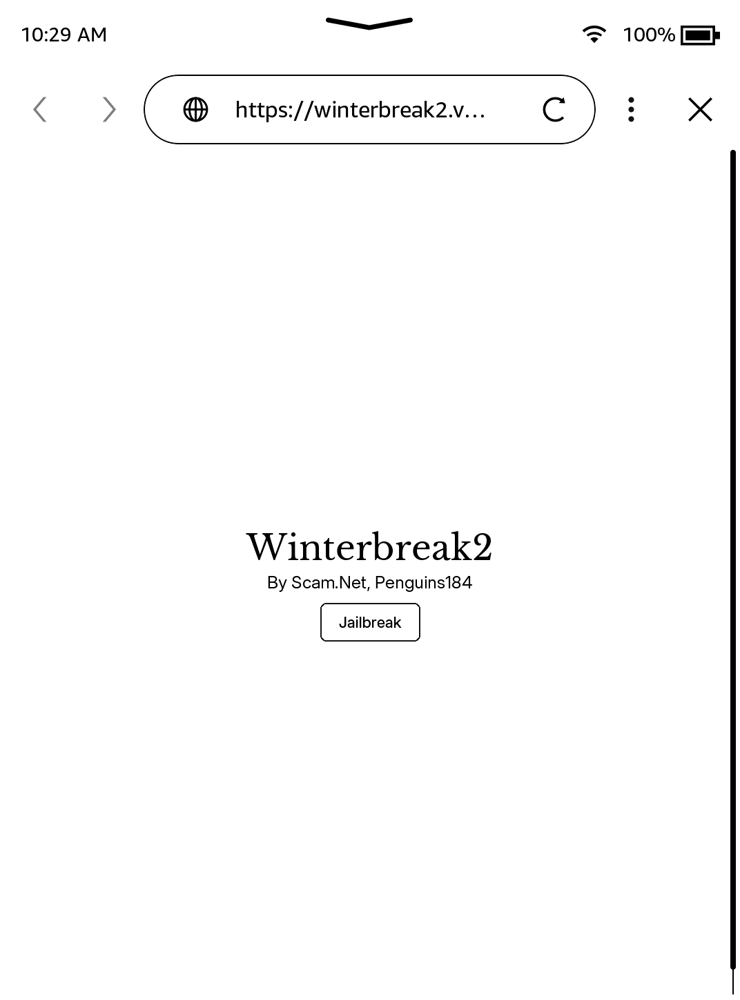

# WinterBreak2

> Any sufficiently advanced technology is indistinguishable from magic.
>  
> \- Arthur C. Clarke

WinterBreak2 is a browser-based jailbreak created by [Scam.Net](https://github.com/KindleModding/Winterbreak2) and [Penguins184](https://github.com/penguins184). It was made as an alternative to [WinterBreak](../WinterBreak/) / [Mesquito](../../mesquito/) for situations where those methods are problematic.

Unlike WinterBreak, WinterBreak2 uses the Kindle's built-in Experimental Browser instead of the Kindle Store, which means:
- **Your Kindle does NOT need to be registered with Amazon**
- **It works on blastlisted devices** (devices where the Kindle Store exploit has been blocked)

> [!NOTE]
> WinterBreak2 only works on firmware versions **below 5.16.4**.
>  
> If your firmware is 5.16.4 or above, you will need to use a different jailbreak method.

## Prerequisites
- You will need a PC
- Your Kindle must be on firmware **below 5.16.4**
- Your Kindle must have a valid, internet-connected Wi-Fi network saved
- Your Kindle's storage must be almost full, with only 50-90 MB of free space remaining to [avoid automatic updates](../prevent-auto-update/)
- File archiver software to unzip files ([7-zip](https://www.7-zip.org/) or [WinRar](https://www.win-rar.com/start.html?&L=0) for Windows)

> [!INFO]
> If you face any issues, please check the [troubleshooting](#troubleshooting) section

## Installation Guide

    

        <button id="prev">Previous Step</button>
        
        <button id="next">Next Step</button>
    

    

        

            <h2>Download the latest WinterBreak2 release:</h2>
            

                <a href="https://github.com/KindleModding/Winterbreak2/releases/latest/download/wb2.zip" class="button">Download</a>
                

                    To prevent your Kindle from automatically updating during the jailbreak process, it is <b>critical</b> you follow <a href="../prevent-auto-update/">this guide</a> before continuing
                

                

                    WinterBreak2 only works on firmware versions <b>below 5.16.4</b>
                     
                    For firmware 5.16.4 &ndash; 5.18.0.2, use <a href="/jailbreaking/WinterBreak">WinterBreak</a>
                     
                    For firmware 5.18.1+, use <a href="/jailbreaking/AdBreak">AdBreak</a>
                

            

        

        

            <h2>Extract WinterBreak2 to your Kindle</h2>
            

                
Plug your Kindle into your computer

                
Extract the contents of <code>wb2.zip</code> to the root of your Kindle's storage

                
You should see the files <code>jb.sh</code>, <code>patchedUks.sqsh</code>, and a <code>winterbreak2</code> folder on the Kindle's root

            

        

        

            <h2>Eject &amp; Connect to Wi-Fi</h2>
            

                
Safely eject the Kindle from your computer

                
Make sure your Kindle is connected to a Wi-Fi network

            

        

        

            <h2>Open the Experimental Browser</h2>
            

                
On your Kindle, open the <b>Experimental Browser</b>

                
You can find it under: <code>Menu → Experimental Browser</code> (or <code>Settings → Device Options → Advanced → Experimental Browser</code> depending on your firmware)

                
Navigate to the following URL:

                
<code>https://winterbreak2.now.sh/</code>

                 
            

        

        

            <h2>Run the Jailbreak</h2>
            

                
Press the <b>Jailbreak</b> button on the page

                
A dialog will open and the jailbreak process will begin

                
Wait for the process to complete

            

        

        

            <h2>Done</h2>
            

                
Once the jailbreak has completed, <b>turn Airplane mode on</b> and continue to the post-jailbreak stage

                

                    If present, delete the <code>update.bin.tmp.partial</code> file from your device to prevent an automatic update
                

            

        

    

    

        <button id="prev">Previous Step</button>
        
        <button id="next">Next Step</button>
    

# Troubleshooting

### The Experimental Browser won't load the page
- Make sure your Kindle is connected to Wi-Fi and has internet access
- Try typing the URL carefully: `https://winterbreak2.now.sh/`
- Reboot your Kindle and try again

### The jailbreak button does nothing
- Ensure you have correctly extracted the `wb2.zip` contents to the root of your Kindle
- Verify the files `jb.sh`, `patchedUks.sqsh`, and the `winterbreak2` folder are on the Kindle's root directory
- Reboot and try again

### Still having issues?
If WinterBreak2 is not working for you, and your firmware is below 5.16.4, try the original [WinterBreak](../WinterBreak/) method instead (requires Amazon registration).

## Credits
- **Scam.Net** — Concept, Discovery
- **Penguins184** — Server
