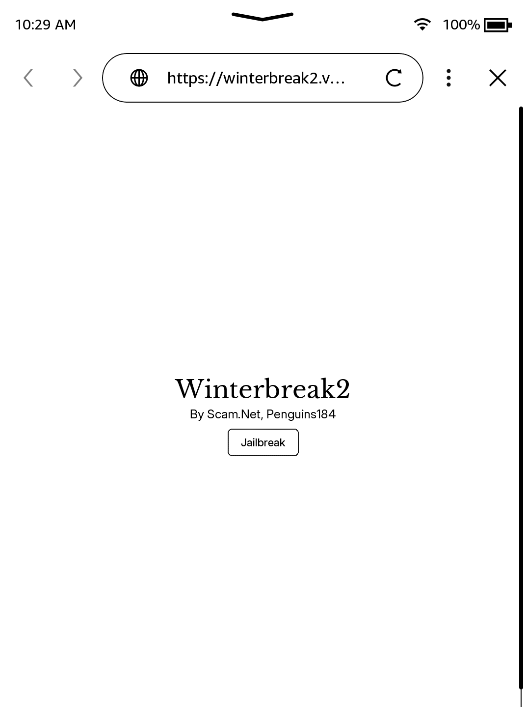

# WinterBreak2

> Any sufficiently advanced technology is indistinguishable from magic.
>  
> \- Arthur C. Clarke

WinterBreak2 is a browser-based jailbreak created by [Scam.Net](https://github.com/KindleModding/Winterbreak2) and [Penguins184](https://github.com/penguins184). 

## Prerequisites

- A PC, Cable, Kindle.
- Unzipping Software (E.g., <a href="https://7-zip.org/">7-Zip</a>)
- A supported model and firmware, as you have been led here by the <b><a href="../../jailbreak-wizard.html">Jailbreaking Wizard</a></b>.
- You have read <a href="../">this overview</a> and <a href="../prevent-auto-update/">filled the device</a>, if applicable
- A Wi-Fi connection.

> [!INFO]
> If you face any difficulty in following these guides, please navigate to the [troubleshooting](#troubleshooting) section, and/or make a ticket in the KindleModding Discord support forums/Community Reddit.

## Installation Guide

    

        <button id="prev">Previous Step</button>
        
        <button id="next">Next Step</button>
    

    

        

            <h2>Before Jailbreaking...</h2>
            

                

                    <b>Warning!</b> 
                    Jailbreaking often involves connecting to the Internet.
                    Before beginning <b>any</b> jailbreaking process, please remember to <a href="../prevent-auto-update/">fill up your Kindle </a> as to avoid ruining the jailbreak mid-process. Additionally, please ensure <b>you have read <a href="../">this</a></b> before you start.
                

                
If you have done the above, please commence to the next step.

            

        

        

            <h2>Download the latest WinterBreak2 release:</h2>
            

                <a href="https://github.com/KindleModding/Winterbreak2/releases/latest/download/wb2.zip" class="button">Download</a>
            

        

        

            <h2>Extract WinterBreak2 to your Kindle</h2>
            

                
Plug your Kindle into your computer

                
Extract the contents of <code>wb2.zip</code> to the root of your Kindle's storage

                
You should see the <code>winterbreak2</code> folder on the Kindle's root

            

        

        

            <h2>Eject &amp; Connect to Wi-Fi</h2>
            

                
Safely eject the Kindle from your computer

                
Make sure your Kindle is connected to a Wi-Fi network

            

        

        

            <h2>Open the Experimental Browser</h2>
            

                
On your Kindle, open the <b>Experimental Browser</b>

                
You can find it under: <code>Menu → Experimental Browser</code> (or <code>Settings → Device Options → Advanced → Experimental Browser</code> depending on your firmware)

                
Navigate to the following URL (May not look identical):

                
<code>https://penguins184.xyz/wb2</code>

                 
            

        

        

            <h2>Run the Jailbreak</h2>
            

                
Press the <b>Jailbreak</b> button on the page

                
A dialog will open and the jailbreak process will begin

                
Wait for the process to complete

            

        

        

            <h2>After Jailbreaking...</h2>
            

                

                    <b>What's Next?</b> 
                    Commence to the <a href="../whats-next">What's Next</a> section to read about installing scriptlets, homebrew, and KOReader. Read the <b>whole section</b> thoroughly.
                

                

                    You may now <b>delete</b> any filler files. Updates have been automatically blocked for you.  
                    Before you do this, also <b>remove any existing update files with a <code>.bin</code> extension</b>, if they exist in the Kindle's root.
                

                
Have fun! :)

            

        

    

    

        <button id="prev">Previous Step</button>
        
        <button id="next">Next Step</button>
    

# Troubleshooting

### The Experimental Browser won't load the page
- Make sure your Kindle is connected to Wi-Fi and has internet access
- Try typing the URL carefully: `https://penguins184.xyz/wb2`
- Reboot your Kindle and try again

### The jailbreak button does nothing
- Ensure you have correctly extracted the `wb2.zip` contents to the root of your Kindle
- Verify the `winterbreak2` folder is on the Kindle's root directory
- Reboot and try again

### Still having issues?
If WinterBreak2 is not working for you, and your firmware is below 5.16.4, try the original [WinterBreak](../WinterBreak/) method instead (requires Amazon registration).

## Credits
- **Scam.Net** - Concept, Discovery
- **Penguins184** - Server, Host
