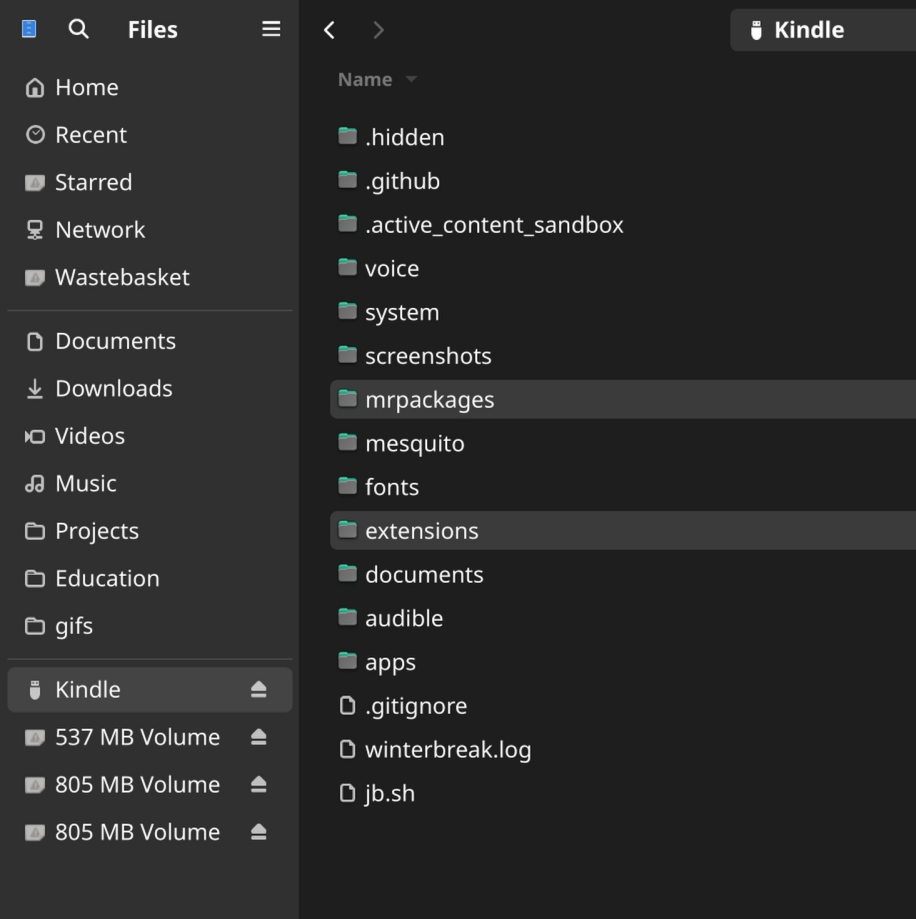
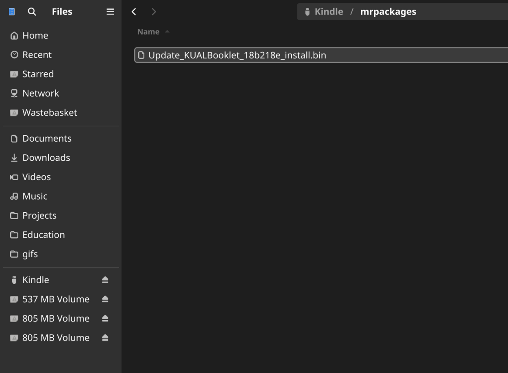
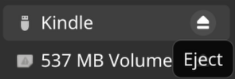
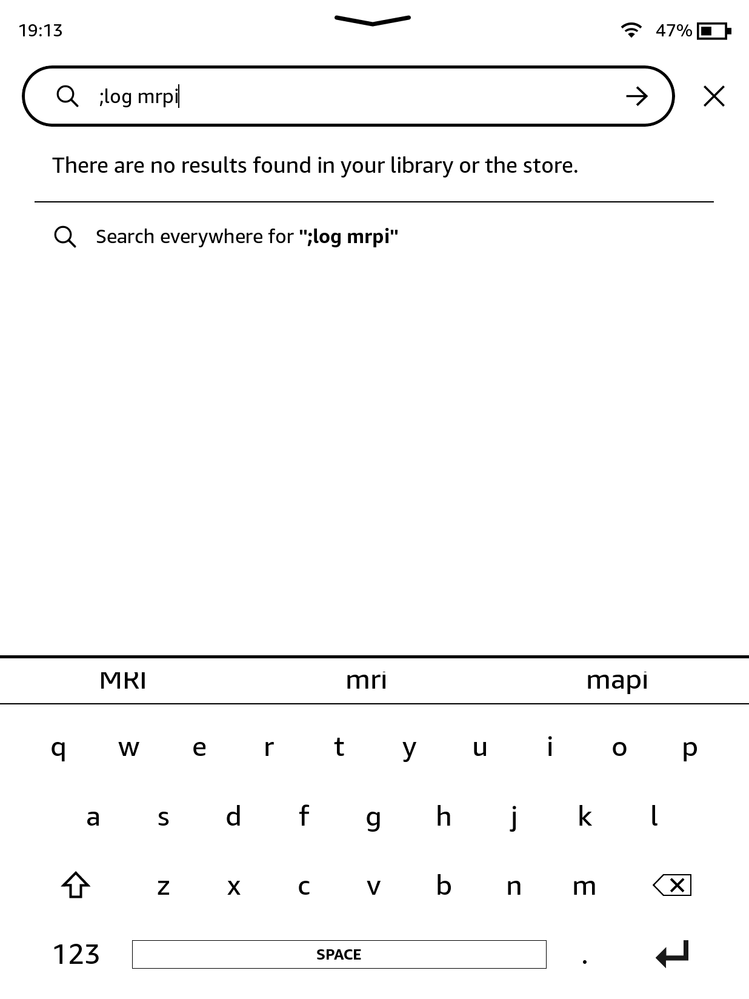

# Installing KUAL and MRPI
You will need to install KUAL (Kindle Unified Application Launcher) and MRPI (MobileRead Package Installer) to run homebrew on your Kindle.

    

        <button class="btn btn-orange" id="prev">Previous Step</button>
        
        <button class="btn btn-green" id="next">Next Step</button>
    

    

        

            <h2>Download MRPI</h2>
            

                <a href="https://fw.notmarek.com/khf/kual-mrinstaller-khf.tar.xz" class="button">MRPI</a>
                
This version of MRPI is provided by <a href="https://fw.notmarek.com/khf/">Marek</a>

            

        

        

            <h2>Download the correct KUAL version</h2>
            

                <a href="./Update_KUALBooklet_HDRepack.bin" class="button">Kual (Coplate) - For Kindles newer than the K5 (any kindle released after 2012)</a>
                
The above version of KUAL is provided by HackerDude

                 
                <a href="https://storage.gra.cloud.ovh.net/v1/AUTH_2ac4bfee353948ec8ea7fd1710574097/mr-public/KUAL/KUAL-v2.7.37-gfcb45b5-20250419.tar.xz" class="button">KUAL - For legacy devices</a>
            

        

        

            <h2>Extracting MRPI</h2>
            

            
Extract the contents of the MRPI tar file you downloaded, and copy the <code>extensions</code> and <code>mrpackages</code> folders to your Kindle.

             
            
            

        

        

            <h2>Extracting/Copying KUAL</h2>
            

                
If you downloaded KUAL for legacy devices, extract the .tar.xz file you downloaded to get the <code>Update_KUALBooklet_*_install.bin</code> file.

                
The above step does not apply if you downloaded KUAL (Coplate).

                 
                
Now, find the <code>Update_KUALBooklet_*_install.bin</code> file and copy it to your Kindle's <code>mrpackages</code> folder.

                 
                
            

        

        

            <h2>Eject and unplug your Kindle</h2>
            

                
            

        

        

            <h2>Running MRPI</h2>
            

                
On your Kindle, type <code>;log mrpi</code> into the search bar and hit enter. It may take a second for the Kindle to appear to be doing anything.

                 
                
            

        

        

            <h2>Done</h2>
            

                
While KUAL is installing, your Kindle screen may turn white and show some icons. After a while you will be returned to your library and see a book titled <code>KUAL</code> has been added. <strong>If you do not see this book,</strong> look at the Troubleshooting steps below.

                
If you see a "Application Error" dialog, you can close it without worry - this is normal behaviour on some modern Kindles.

                 
                
            

        
    
    

    

        <button class="btn btn-orange" id="prev">Previous Step</button>
        
        <button class="btn btn-green" id="next">Next Step</button>
    

## Troubleshooting
- The installation of `Update_KUALBooklet_hotfix_*_install.bin` may fail if there is not enough free space on your Kindle. If you are using the "fill storage" method to block updates, make sure to free up some space before proceeding with these steps.
- Verify the location of all the folders and files on the Kindle
- Try copying the `Update_KUALBooklet_hotfix_*_install.bin` file to the root of your Kindle while connected to your PC. Then go to `Settings` > `Update Your Kindle`, wait for it to reboot, and then resume from `Step 5 - Eject and unplug your Kindle`.