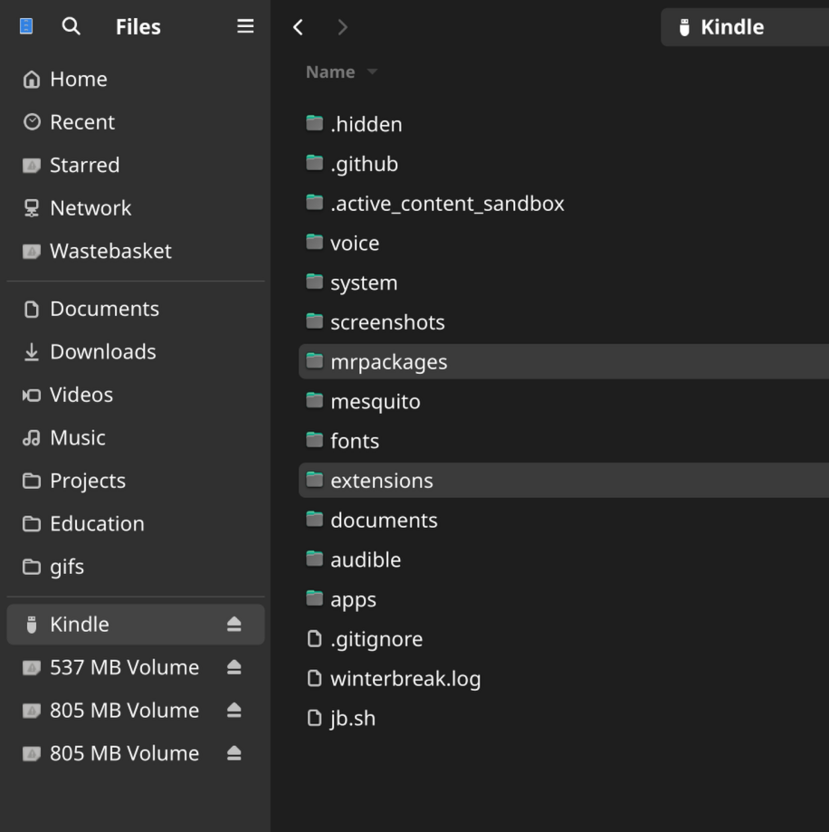
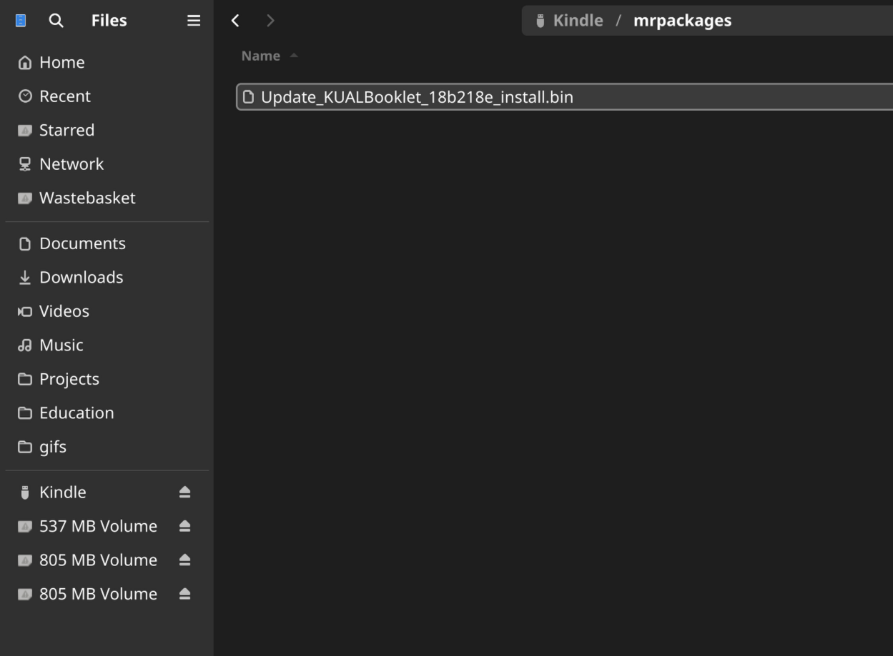
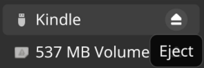
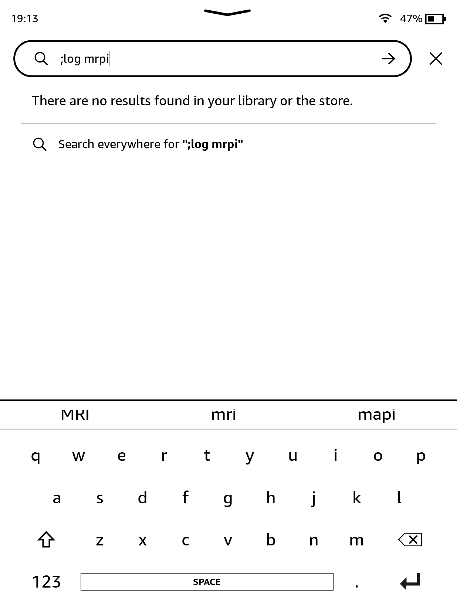

# Installing KUAL and MRPI
You will need to install KUAL (Kindle Unified Application Launcher) and MRPI (MobileRead Package Installer) to run homebrew on your Kindle.

    

        <button class="btn btn-orange" id="prev">Previous Step</button>
        
        <button class="btn btn-green" id="next">Next Step</button>
    

    

        

            <h2>Download MRPI</h2>
            

                <a class="button" href="./kual-mrinstaller-khf.tar.xz">MRPI</a>
                
This version of MRPI is provided by <a href="https://fw.notmarek.com/khf/">Marek</a>

                
You may need to free up 500 MB of space to install both MRPI and KUAL <a href="#troubleshooting">without issues</a>

            

        

        

            <h2>Download the correct KUAL version</h2>
            

                <a class="button" href="./Update_KUALBooklet_HDRepack.bin">KUAL (Coplate) - For Kindles newer than the K5 (any kindle released after 2012)</a>
                
The above version of KUAL is provided by HackerDude

                 
                <a class="button" href="./KUAL-v2.7.37-gfcb45b5-20250419.tar.xz">KUAL - For legacy devices</a>
                <a class="button" href="https://github.com/KindleTweaks/PEKI" style="margin-top: 10px;">PEKI - Follow this guide instead if Coplate is broken</a>
            

        

        

            <h2>Extracting MRPI</h2>
            

            
Extract the contents of the MRPI tar file you downloaded, and copy the <code>extensions</code> and <code>mrpackages</code> folders to your Kindle

             
            
            

        

        

            <h2>Extracting/Copying KUAL</h2>
            

            
If your device is older than the K5 (Kindle Touch), you only need to copy the <code>KUAL-KDK-1.0.azw2</code> file to your Kindle's <code>documents</code> folder, you can skip the next steps

            
If you downloaded KUAL for <strong>legacy devices</strong>, extract the .tar.xz to get the <code>Update_KUALBooklet_*_install.bin</code> file

            
Copy the <code>Update_KUALBooklet_*_install.bin</code> file to your Kindle's <code>mrpackages</code> folder

                 
                
            

        

        

            <h2>Eject and unplug your Kindle</h2>
            

                
            

        

        

            <h2>Running MRPI</h2>
            

                
On your Kindle, type <code>;log mrpi</code> into the search bar and hit enter

                 
                
            

        

        

            <h2>Done</h2>
            

                
Now wait whilst KUAL is installed, your Kindle screen turns white and shows some icons, after a while you will be returned to your library and see a <code>KUAL</code> book appear in it.

                
If you see a "Application Error" dialog, you can close it without worry - this is normal behaviour on some modern Kindles

                 
                
                
If you face any issues, please read the <a href="#troubleshooting">troubleshooting</a> section.

            

        
    
    

    

        <button class="btn btn-orange" id="prev">Previous Step</button>
        
        <button class="btn btn-green" id="next">Next Step</button>
    

## Troubleshooting

- The installation or functionality of **KUAL** and **MRPI** may fail if there is not enough free space on your Kindle. If you are using the "[fill storage](../../prevent-auto-update/)" method to block updates, make sure your Kindle has at least `500 MB` of available space before installing KUAL and MRPI
- Verify that all folders and files are in the correct locations on your Kindle.
- Try restarting the Kindle if the `;log mrpi` command is not responding
- Ensure that the file does not have any special characters such as brackets in it, some browsers may rename files adding `(1)` or other additional suffixes to the file name and these should be removed before copying to the Kindle