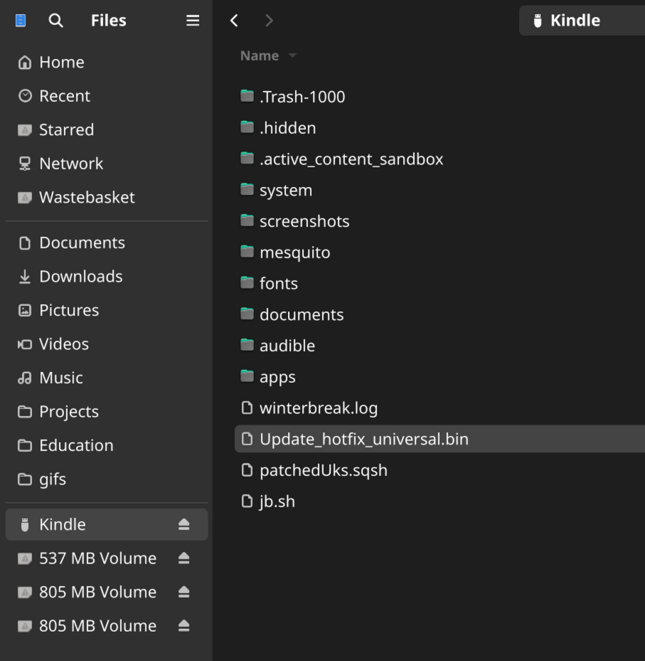
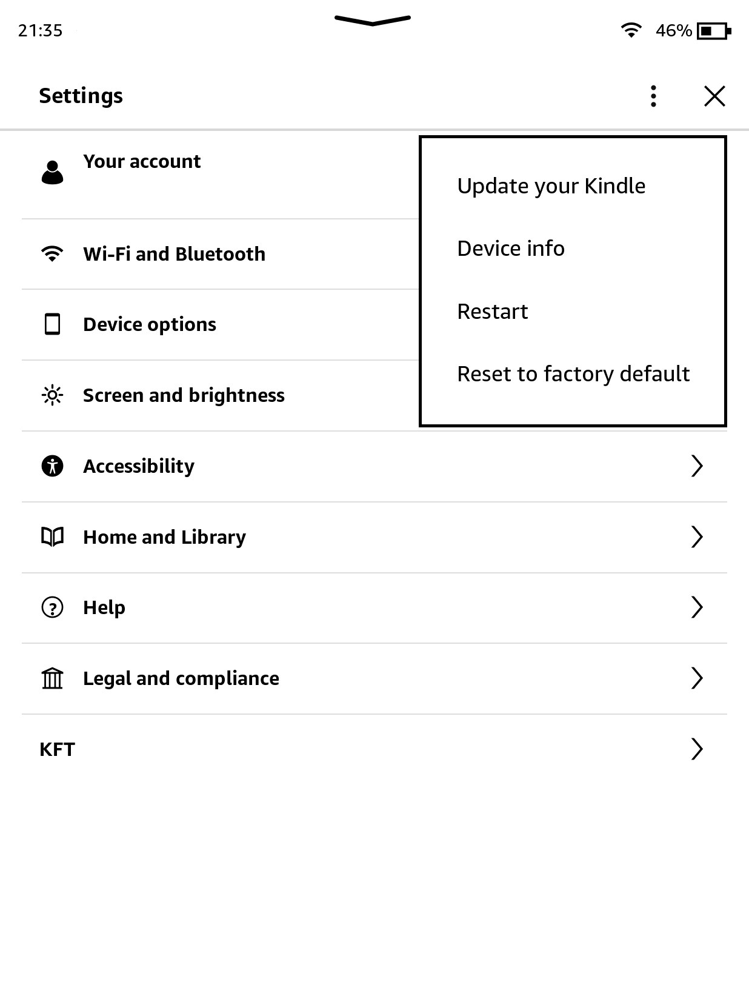
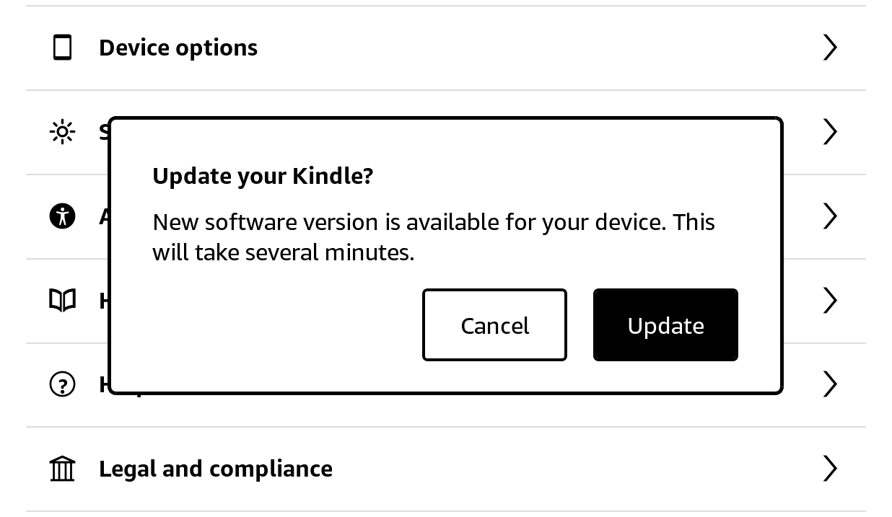
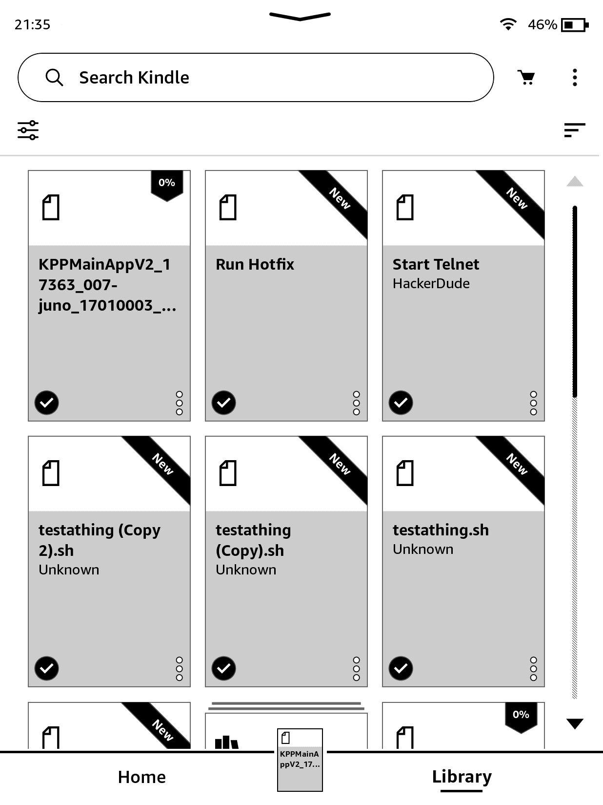

# Setting Up A Hotfix
A hotfix allows your Kindle's jailbreak to persist after updating. There are two different hotfixes and which one you need to install depends on which method you used to jailbreak your Kindle.

<blockquote class="info">
If you installed OTARenamer, make sure to uninstall it beforehand or the hotfix will not be detected by the Kindle
</blockquote>

    

        <button class="btn btn-orange" id="prev">Previous Step</button>
        
        <button class="btn btn-green" id="next">Next Step</button>
    

    

        

            <h2>Download The Hotfix</h2>
            

                <a href="https://github.com/KindleModding/Hotfix/releases/latest/download/Update_hotfix_universal.bin" class="button">Download</a>
                 
                <a href="https://github.com/KindleModding/Hotfix/releases/download/v2.2.1/Update_hotfix_universal.bin" class="button">Download (Compatibility)</a>

                

                    If scriptlets don't work, please redo these steps using the <b>compatibility hotfix!</b>
                

            

        

        

            <h2>Copy The Hotfix</h2>
            

                
Plug your Kindle into your PC and copy the <code>Update_hotfix_universal.bin</code> file to it

                

                   If you see any other files on your Kindle ending in <code>.bin</code>, or have a similar name to <code>update.bin.tmp.partial</code>, you must delete them for the hotfix to work.   Remember to enable Airplane mode to prevent any automatic updates from downloading
                

                
            

        

        

            <h2>Install The Hotfix</h2>
            

                
Eject the Kindle and unplug it, then open settings, click on the three dots, and select <code>Update Your Kindle</code>

                 
                
            

        

        

            <h2>Confirming Hotfix Install</h2>
            

                
If asked, select <code>Update</code>. You can expect this to install the hotfix, as an update.

                 
                
            

        

        

            <h2>Running the hotfix</h2>
            

                
Once the hotfix has installed, you'll need to run it.

                
Run the hotfix by selecting the <code>Run Hotfix</code> booklet in your library.

                
Once the hotfix is done running, you can install <code>KUAL</code> and <code>MRPI</code>

                
You will need to run the hotfix booklet after every OTA update

                
            

        

    

    

        <button class="btn btn-orange" id="prev">Previous Step</button>
        
        <button class="btn btn-green" id="next">Next Step</button>
    

# Troubleshooting

## Hotfix Won't Install
There is a good chance that after installing an older version of Hotfix you disabled OTA updates, meaning the Hotfix update file will be ignored!

**Follow these steps to update the Hotfix:**
1. Activate airplane mode
2. Enable OTA update (KUAL -> Rename OTA binaries -> Restore)
3. Follow the Hotfix installation instructions above
4. Disable OTA update (KUAL -> Rename OTA binaries -> Rename)