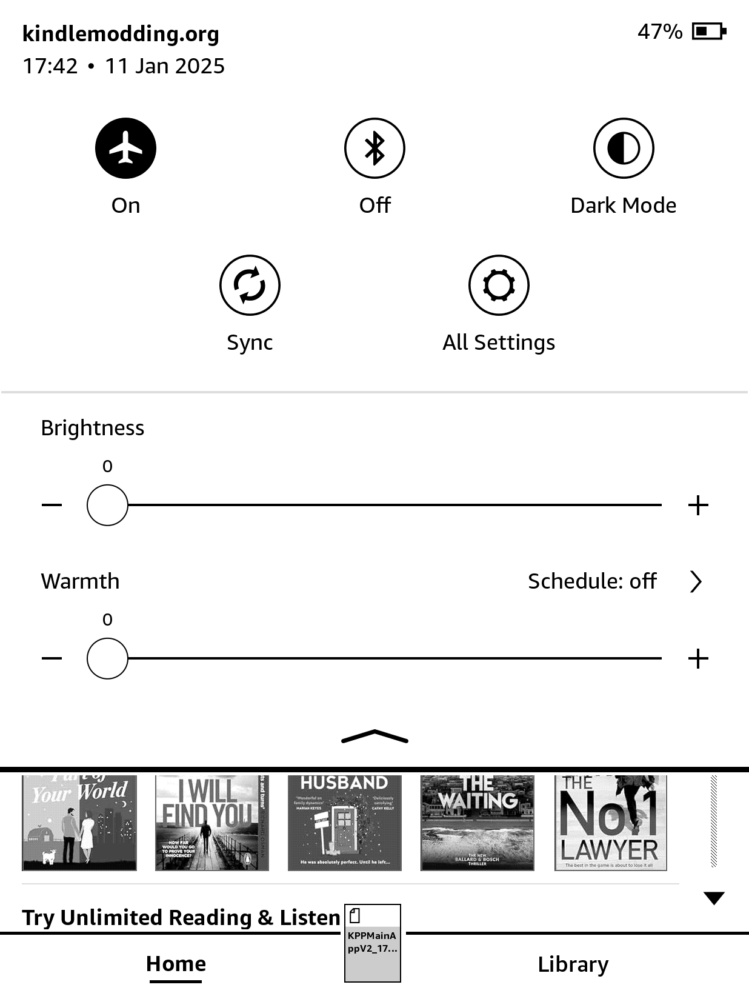
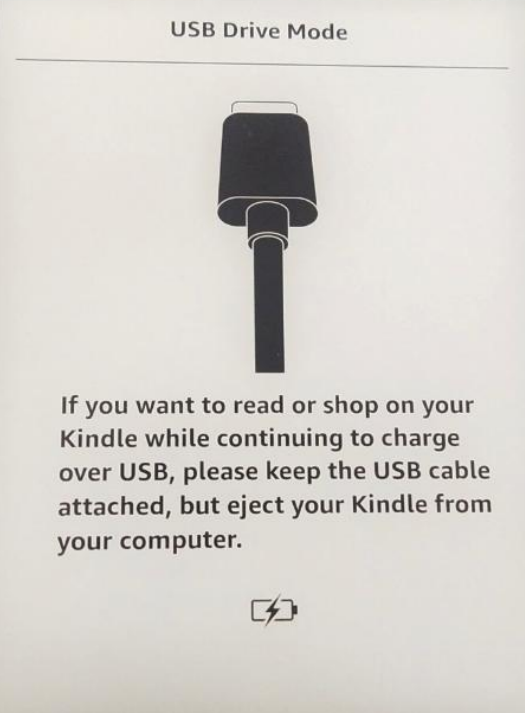
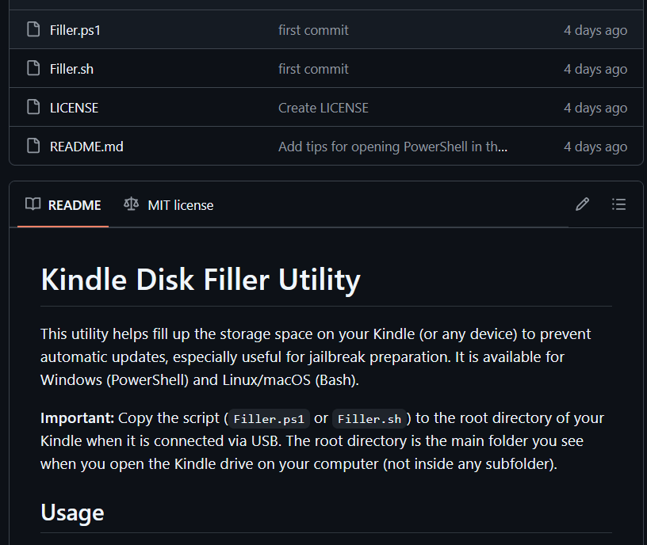
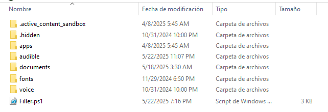
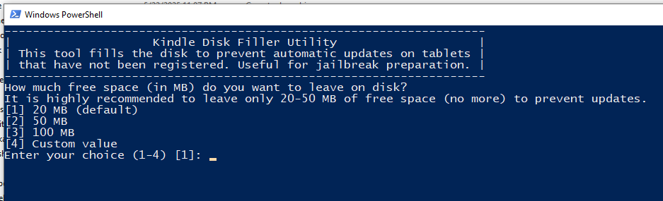
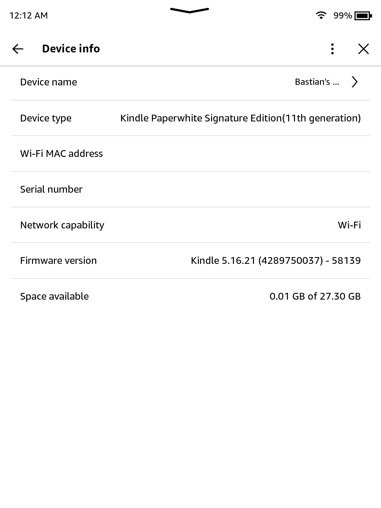
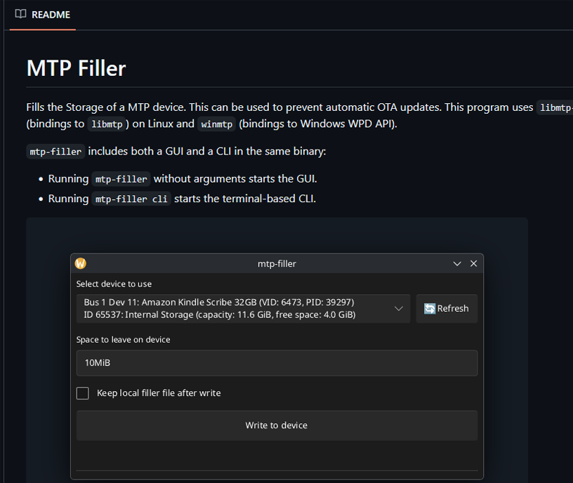
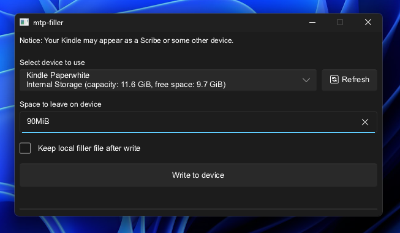
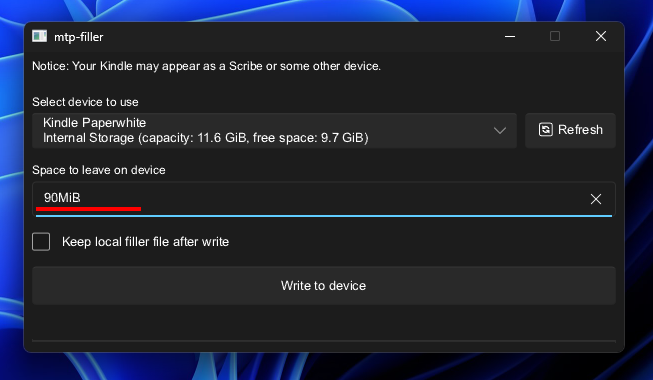

# Preventing Automatic Updates by Filling Kindle Storage

## Why Fill the Kindle's Storage?

Kindle devices can automatically download and install firmware updates when they have enough free storage space. These updates can block jailbreaking methods. Automatic updates may occur when:

- You open the Kindle Store.
- You register your Kindle to an Amazon account.
- The device is connected to Wi-Fi, even briefly.
- The Kindle is rebooted while connected to the internet.

Filling the Kindle's storage with dummy files (leaving only 50-90 MB free) prevents the device from downloading and installing updates, as the update process requires more free space (update files take up to 300MB in space).

## Filling Your Kindle's Storage

Starting with the Kindle 11th generation (2024) and the Kindle Scribe (2022, <strong>on recent firmware</strong>), devices use MTP (Media Transfer Protocol), while older models use the standard USB protocol. Follow the right guide for your device.
  
If your device is <strong>older than</strong> the Kindle 11th generation (KT6, 2024), follow the non-MTP Filler guide. 
If your device is the Kindle 11th generation (KT6, 2024) or newer, follow the MTP Filler guide.  
<a href="../../kindle-models.html">Identify your Kindle model generation here</a>

Delete any file named <code>update-whatever.bin</code> OR <code>update.partial.bin</code>, and turn on Airplane Mode!

<h2>Kindle-Filler-Disk (non-MTP Kindles)</h2>

    

        <button id="prev">Previous Step</button>
        
        <button id="next">Next Step</button>
    

    

        

            <h2>1. Put Your Kindle in Airplane Mode</h2>
            

                
Turn on Airplane mode on your Kindle

                
                
<em>This guide only works on non-MTP Kindles</em>

            

        

        

            <h2>2. Connect Your Kindle to Your Computer via USB</h2>
            

                
Use a USB cable to connect your Kindle to your computer.

                
                
Wait for the Kindle to appear as a USB drive.

            

        

        

            <h2>3. Download the Disk Filler Script</h2>
            

                
Go to the <a href="https://github.com/bastianmarin/Kindle-Filler-Disk/">Kindle-Filler-Disk GitHub repository</a>.

                
                
Download the appropriate script for your operating system:

                

                    <strong>Windows:</strong> <code>Filler.ps1</code> 
                    <strong>macOS/Linux:</strong> <code>Filler.sh</code>
                

            

        

        

            <h2>4. Move the Script to Your Kindle</h2>
            

                
Copy the downloaded script file to the root directory of your Kindle (the main folder you see when you open the Kindle as a USB drive).

                
                <strong>Windows:</strong> <code>Filler.ps1</code> 
                <strong>macOS/Linux:</strong> <code>Filler.sh</code>
            

        

          

              <h2>5. Run the Script</h2>
              

                

                    
Windows:

                    
Open File Explorer and navigate to your Kindle drive.

                    
Right-click <code>Filler.ps1</code> and select <strong>Run with PowerShell</strong>.

                    
If you see an execution policy error, open PowerShell in the Kindle drive and run:

                    <pre><code>powershell -ExecutionPolicy Bypass -File .\Filler.ps1</code></pre>
                

                

                    
macOS/Linux:

                    
Open a terminal in the Kindle drive where <code>Filler.sh</code> is located.

                    
Make it executable if needed:

                    <pre><code>chmod +x Filler.sh</code></pre>
                    
Run the script:

                    <pre><code>./Filler.sh</code></pre>
                

              
     
            

        

            <h2>6. Select the Storage Amount</h2>
            

                
Select the numbered option corresponding to how much storage you want to fill on your device.

                
            

        

        

            <h2>7. Safely Disconnect and Verify Storage</h2>
            

                
Eject your Kindle from your computer.

                
On your Kindle, go to <strong>Settings &gt; Device Options &gt; Device Info</strong> (or similar).

                
Check that the available storage is <strong>50-90 MB or less</strong>.

                
            

        
     
        

            <h2>8. Continue with Jailbreak</h2>
            

                
With storage nearly full, you can now connect to Wi-Fi and register your Kindle to your Amazon account.
 
                
The Kindle will not be able to fully download the update due to a lack of space.

                
You can either perform a <a href="/kindle-models.html">Jailbreak suitable for your device</a> or wait for the next jailbreak to be released.
 
                

                  Always make sure to delete any files ending with <code>.bin</code> or named <code>update.bin.tmp.partial</code>
                

            

        

    

    

        <button id="prev">Previous Step</button>
        
        <button id="next">Next Step</button>
    

 
<h2>MTP-Filler (MTP Kindles)</h2>

    

        <button id="prev">Previous Step</button>
        
        <button id="next">Next Step</button>
    

    

        

            <h2>1. Put Your Kindle in Airplane Mode</h2>
            

                
Turn on Airplane mode on your Kindle

                
                
<em>This guide only works on MTP Kindles</em>

            

        

        

            <h2>2. Connect Your Kindle to Your Computer via USB</h2>
            

                
Use a USB cable to connect your Kindle to your computer.

                
                
Wait for the Kindle to appear as a USB drive.

            

        

        

            <h2>3. Download the MTP Filler Script</h2>
            

                
Go to the <a href="https://github.com/jannikac/mtp-filler/releases/latest">MTP-Filler GitHub Releases page</a> and download the appropriate script for your operating system

                
                

                 
                    <strong>Windows:</strong> <code>mtp-filler-*.exe</code> 
                    <strong>macOS:</strong> <code>mtp-filler-*-macos-arm64</code> (M-series) or <code>mtp-filler-v*-macos-x86_64</code> (Intel) 
                    <strong>Linux:</strong> <code>mtp-filler-*-linux-x86_64 </code>
                

            

        

        

            <h2>4. Run the Script</h2>
            

                
Locate the script file and double-click it to open. Your Kindle should be automatically detected.

                
                
If you're on macOS or Linux, you might have to make it executable first. Open a terminal and navigate where the script is located, execute <code>chmod +x ./mtp-filler</code> and run the script with <code>./mtp-filler</code>.
            

        

          

              <h2>5. Type the Storage Amount</h2>
              

              
Type the storage you want to leave on the device in binary units (MB would be MiB) and click the <code>Write to Device</code> button.

            
            
If you face any issues with this script, please read the <a href="https://github.com/jannikac/mtp-filler#troubleshooting">troubleshooting section</a> from the repository
              
     
            

        

            <h2>6. Safely Disconnect and Verify Storage</h2>
            

                
Eject your Kindle from your computer.

                
On your Kindle, go to <strong>Settings &gt; Device Options &gt; Device Info</strong> (or similar).

                
Check that the available storage is <strong>50-90 MB or less</strong>.

                
            

        
     
        

            <h2>8. Continue with Jailbreak</h2>
            

                
With storage nearly full, you can now connect to Wi-Fi and register your Kindle to your Amazon account.
 
                
The Kindle will not be able to fully download the update due to a lack of space.

                
You can either perform a <a href="/kindle-models.html">Jailbreak suitable for your device</a> or wait for the next jailbreak to be released.
 
                

                  Always make sure to delete any files ending with <code>.bin</code> or named <code>update.bin.tmp.partial</code>
                

            

        

    

    

        <button id="prev">Previous Step</button>
        
        <button id="next">Next Step</button>
    

---

## After Jailbreak: Freeing Up Space

Once you have completed the jailbreak process and [disabled the OTA Updates](../post-jailbreak/disable-ota), you can safely delete the `fill_disk` folder or any other file generated by the scripts to recover storage space. You may also remove only some of the files if you want to keep the disk nearly full for a while longer. 

If you're on macOS or Linux, your files may still be on your device in a folder named `.Trash-1000`. Make sure to delete this folder as well.