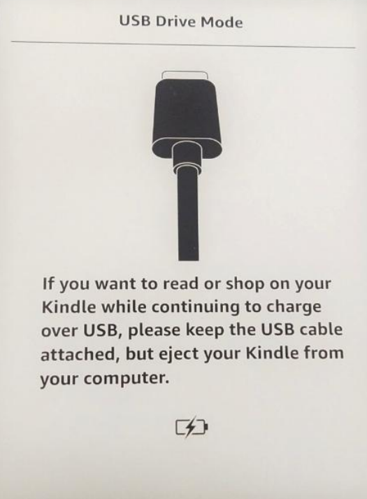
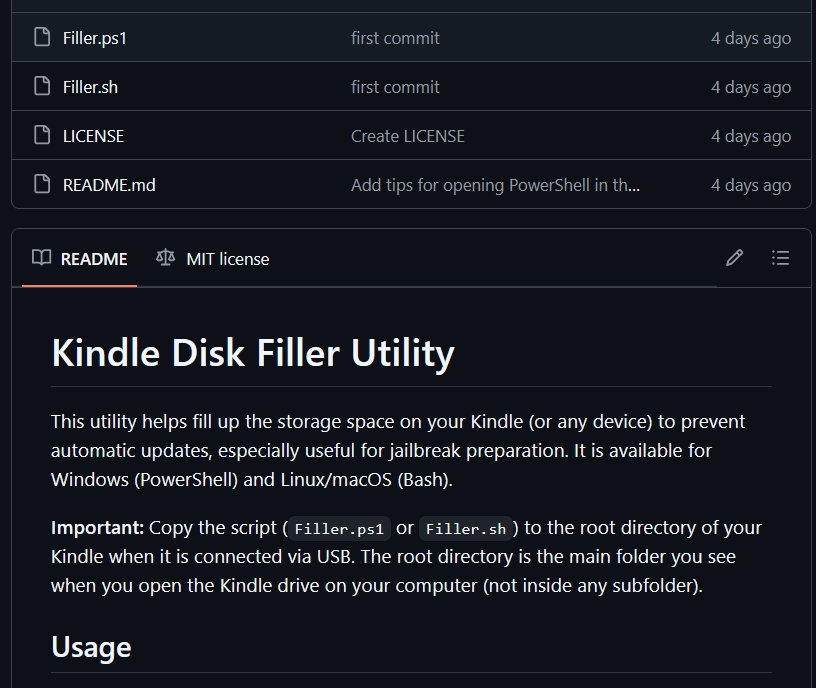
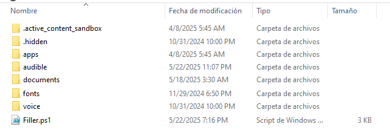
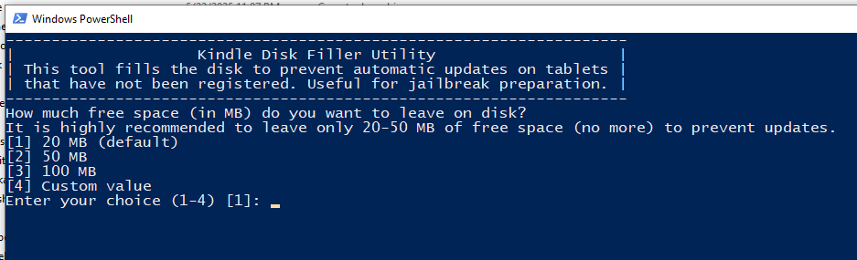
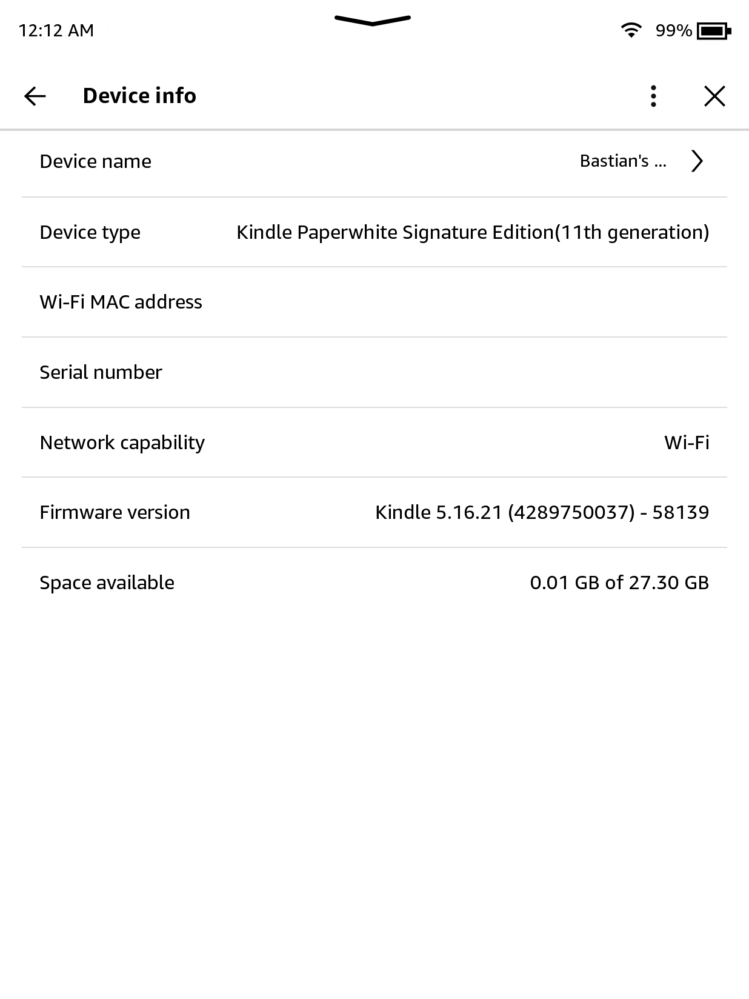

# Preventing Automatic Updates by Filling Kindle Storage

## Why Fill the Kindle's Storage?

Kindle devices can automatically download and install firmware updates when they have enough free storage space. These updates can block jailbreaking methods. Automatic updates may occur when:

- You open the Kindle Store.
- You register your Kindle to an Amazon account.
- The device is connected to Wi-Fi, even briefly.
- The Kindle is rebooted while connected to the internet.

Filling the Kindle's storage (leaving only 20-90 MB free) prevents the device from downloading and installing updates, as the update process requires more free space.

## How to Fill the Kindle's Storage

> [!WARNING]
> Delete `update-whatever.bin` OR `update.partial.bin`, and turn on Airplane Mode!

You can use a simple script to fill your Kindle's storage with dummy files, leaving only a small amount of free space. This script is available in the [Kindle-Filler-Disk GitHub repository](https://github.com/bastianmarin/Kindle-Filler-Disk/) along with other useful scripts for Windows, macOS, and Linux.

> [!NOTE]
> The script will not work on 11th gen Kindles and newer because these devices use MTP to connect to computers

> If this is your situation, you have two options:
> 1. Delete any stray files ending in <code>.bin</code>, or have a similar name to <code>update.bin.tmp.partial</code> manually at every step of the Jailbreak guide (or before doing any rebooting)
> 2. Manually fill your Kindle. Download the [Filler files](https://github.com/bastianmarin/Kindle-Filler-Disk/tree/main/MTP/) that match your Kindle's storage from the link below. Extract the files, then move them to the root of your Kindle (you can also save them on a separate folder). After doing so, make sure to leave only 20–90 MB of free space

<div id="guide">
    <div class="buttons">
        <button class="btn btn-orange" id="prev">Previous Step</button>
        <span id="stepCounter"></span>
        <button class="btn btn-green" id="next">Next Step</button>
    </div>
    <div id="stepwrapper" class="stepwrapper">
        <div class="step">
            <h2>1. Put Your Kindle in Airplane Mode</h2>
            <div class="stepContent">
                <p>Turn on Airplane mode on your Kindle</p>
                
            </div>
        </div>
        <div class="step">
            <h2>2. Connect Your Kindle to Your Computer via USB</h2>
            <div class="stepContent">
                <p>Use a USB cable to connect your Kindle to your computer.</p>
                
                <p>Wait for the Kindle to appear as a USB drive.</p>
            </div>
        </div>
        <div class="step">
            <h2>3. Download the Disk Filler Script</h2>
            <div class="stepContent">
                <p>Go to the <a href="https://github.com/bastianmarin/Kindle-Filler-Disk/">Kindle-Filler-Disk GitHub repository</a>.</p>
                
                <p>Download the appropriate script for your operating system:</p>
                <div style="margin-left:2em">
                    <span><strong>Windows:</strong> <code>Filler.ps1</code></span><br/>
                    <span><strong>macOS/Linux:</strong> <code>Filler.sh</code></span>
                </div>
            </div>
        </div>
        <div class="step">
            <h2>4. Move the Script to Your Kindle</h2>
            <div class="stepContent">
                <p>Copy the downloaded script file to the root directory of your Kindle (the main folder you see when you open the Kindle as a USB drive).</p>
                
                <span><strong>Windows:</strong> <code>Filler.ps1</code></span><br/>
                <span><strong>macOS/Linux:</strong> <code>Filler.sh</code></span>
            </div>
        </div>
          <div class="step">
              <h2>5. Run the Script</h2>
              <div class="stepContent">
                <div class="version-block">
                    <p class="version-label">Windows:</p>
                    <p>Open File Explorer and navigate to your Kindle drive.</p>
                    <p>Right-click <code>Filler.ps1</code> and select <strong>Run with PowerShell</strong>.</p>
                    <p>If you see an execution policy error, open PowerShell in the Kindle drive and run:</p>
                    <pre><code>powershell -ExecutionPolicy Bypass -File .\Filler.ps1</code></pre>
                </div>
                <div class="version-block">
                    <p class="version-label">macOS/Linux:</p>
                    <p>Open a terminal in the Kindle drive where <code>Filler.sh</code> is located.</p>
                    <p>Make it executable if needed:</p>
                    <pre><code>chmod +x Filler.sh</code></pre>
                    <p>Run the script:</p>
                    <pre><code>./Filler.sh</code></pre>
                </div>
                
              </div>     
            </div>
        <div class="step">
            <h2>6. Safely Disconnect and Verify Storage</h2>
            <div class="stepContent">
                <p>Eject your Kindle from your computer.</p>
                <p>On your Kindle, go to <strong>Settings &gt; Device Options &gt; Device Info</strong> (or similar).</p>
                <p>Check that the available storage is <strong>20-90 MB or less</strong>.</p>
                
            </div>
        </div>
        <div class="step">
            <h2>7. Register Your Kindle</h2>
            <div class="stepContent">
                <p>With storage nearly full, connect to Wi-Fi and register your Kindle to your Amazon account. The device will not be able to download updates due to lack of space.</p>
            </div>
        </div>
        <div class="step">
            <h2>8. Enable Airplane Mode Again</h2>
            <div class="stepContent">
                <p>Immediately after registration, enable <strong>Airplane Mode</strong> to prevent any update attempts.</p>
                <p>Proceed with the next jailbreak steps (such as WinterBreak).</p>
                <p class="highlight">
                    <strong>Important Note:</strong> After filling your Kindle's storage, check its contents in the <strong>main folder</strong> (root directory) and delete any files ending with <code>.bin</code> or named <code>update.bin.tmp.partial</code>. These files are automatic update attempts by the Kindle and should be removed to prevent the device from trying to install an update when you free up space.
                </p>
            </div>
        </div>
    </div>
    <div class="buttons">
        <button class="btn btn-orange" id="prev">Previous Step</button>
        <span id="stepCounter"></span>
        <button class="btn btn-green" id="next">Next Step</button>
    </div>
</div>

<script>new Guide("guide", "./getting-started", "Jailbreak");</script>

---

## After Jailbreak: Freeing Up Space

Once you have completed the jailbreak process and disabled the OTA Updates, you can safely delete the `fill_disk` folder to recover storage space. You may also remove only some of the files if you want to keep the disk nearly full for a while longer.

- **Windows:**  
  Open File Explorer and navigate to the folder containing `fill_disk`. Delete the `fill_disk` folder, or remove individual files inside it.

- **Linux / macOS:**  
  Open a terminal in the folder containing `fill_disk` and run:
  ```sh
  rm -rf fill_disk
  ```
  Or remove individual files as needed.

This will restore your available disk space.

---

For more scripts and detailed guides, visit the [Kindle-Filler-Disk GitHub repository](https://github.com/bastianmarin/Kindle-Filler-Disk/).
