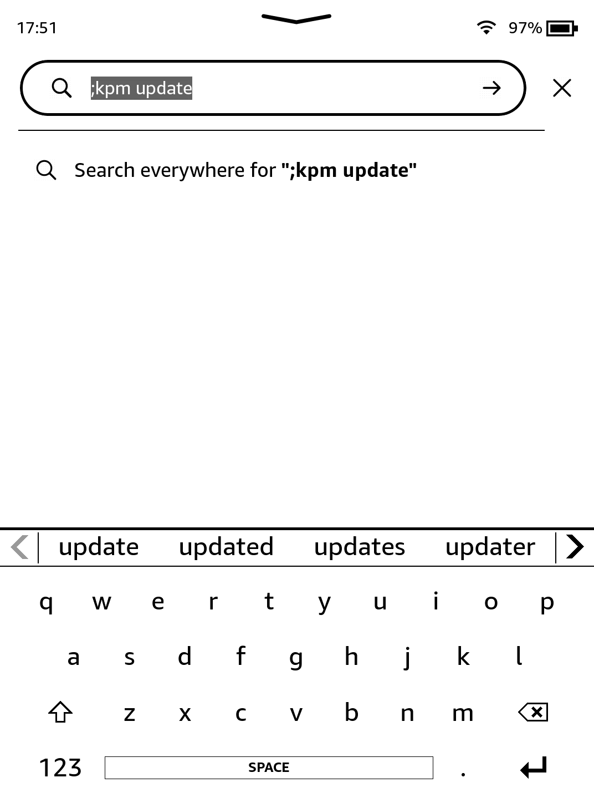
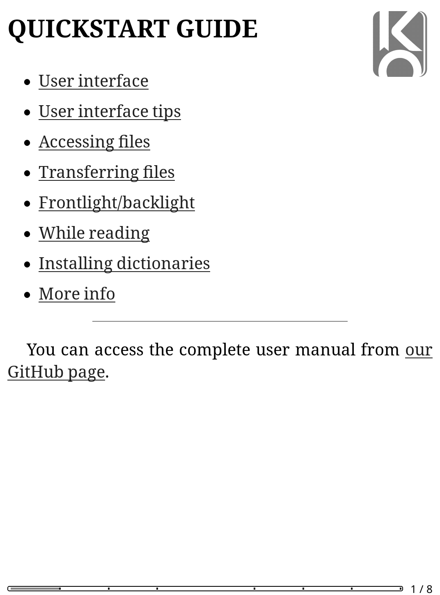

# Getting KOReader

KOReader is a document viewer for E-Ink devices. Supported formats include EPUB, PDF, DjVu, XPS, CBT, CBZ, FB2, PDB, TXT, HTML, RTF, CHM, DOC, MOBI and ZIP files.

    This package is being installed from the official KindleModding KPM repository, <a href="https://repo.kindlemodding.org/">repo.kindlemodding.org</a>.

    

        <button id="prev">Previous Step</button>
        
        <button id="next">Next Step</button>
    

    

        

            <h2>Reboot</h2>
            

                
If you have just jailbroken, and have not yet rebooted, <b>Reboot Now.</b>
 
After this, ensure Wi-Fi is <b>enabled</b> on your device.

            

        

        

            <h2>Update Sources</h2>
            

                
Run <code>;kpm update</code> in the searchbar on the homescreen (and press return/enter).
 
You will see some text at the top of the screen, before you're returned to the homepage.

                
            

        

        

            <h2>Install</h2>
            

                
Now, run <code>;kpm install koreader</code> in the searchbar.
 
Wait a few moments, you'll be returned to the homescreen and a new Scriptlet will have appeared (the icon may not instantly appear).

                
            

        

        

            <h2>Run!</h2>
            

                
Click on it, and KOReader will run!
 
Alternatively, you can also run <code>;kpm launch koreader</code> to use it.

                
            

        

        

            <h2>Uninstallation</h2>
            

                
If you ever wish to uninstall it, simply run <code>;kpm uninstall koreader</code>. Simple!  All KPM packages are installed in this way.

            

        

    

    

        <button id="prev">Previous Step</button>
        
        <button id="next">Next Step</button>
    

