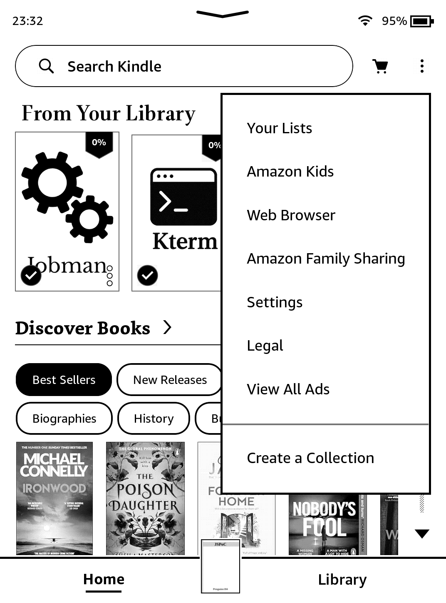
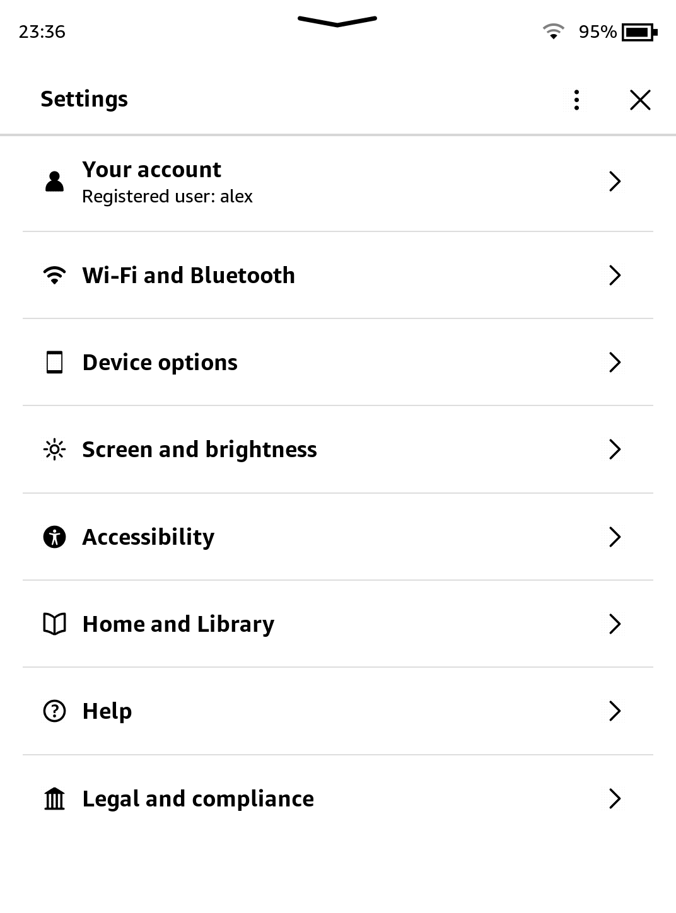
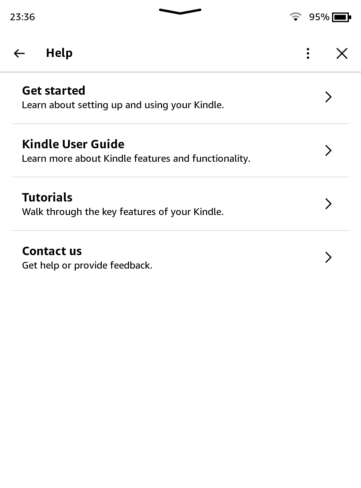

# Rootless Stack

    <b>Rootless Notice</b> 
    Hey there! <b>Only follow this section</b> if you are on one of the following devices: 
    <ul>
        <li>Kindle Scribe Coloursoft (KSC)</li>
        <li>Kindle Scribe 3 (KS3)</li>
        <li>Kindle Scribe 3 - No Frontlight (KS3NFL)</li>
        <li>Kindle - 2026 Release (Aluminium) (KT7)</li>
    </ul> 
    Otherwise, commence to <a href="../installing-homebrew.html">Installing Homebrew</a>.

New Kindle devices have implemented a technology called [dm-verity](https://source.android.com/docs/security/features/verifiedboot/dm-verity).

In simple terms, jailbreaks on these devices have to be reinitialised on every reboot for them to function properly!

## How to Use my Jailbreak

    

        <button id="prev">Previous Step</button>
        
        <button id="next">Next Step</button>
    

    

        

            <h2>Enter settings...</h2>
            

                Press the three dots > Settings:  
                
            

        

        

            <h2>Press "Help"</h2>
            

                Click on the "Help" menu item:  
                
            

        

        

            <h2>Click on "Get Started"</h2>
            

                Tap "Get Started", then the GUI will restart.  
                
            

        

        

            <h2>Finish</h2>
            

                The jailbreak will be re-initialised and will work correctly again.  You must do this every reboot.
            

        

    

    

        <button id="prev">Previous Step</button>
        
        <button id="next">Next Step</button>
    

