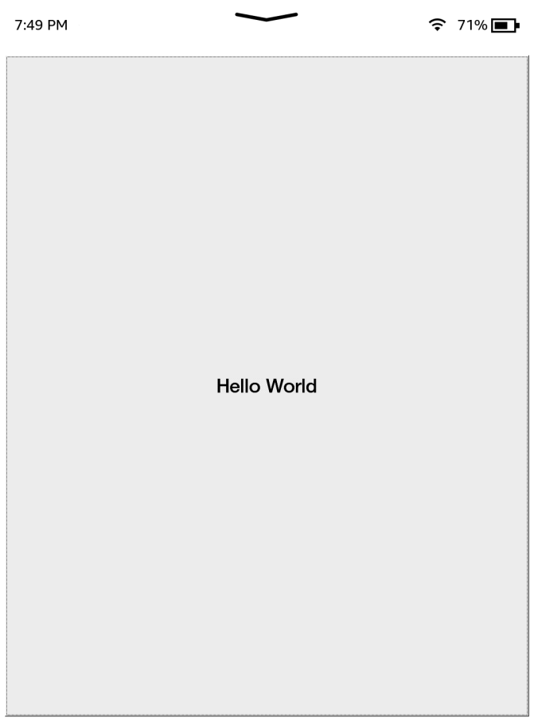
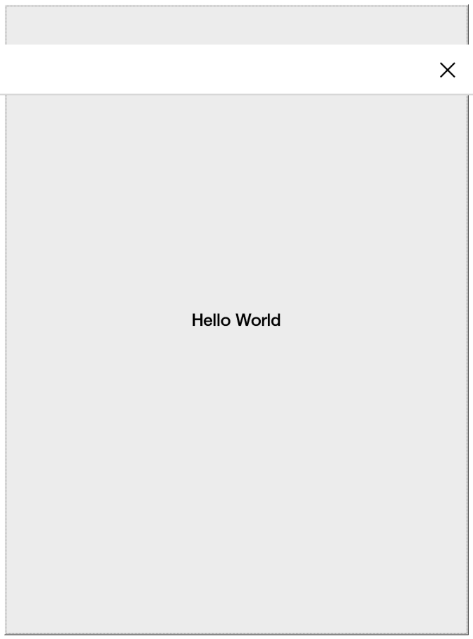
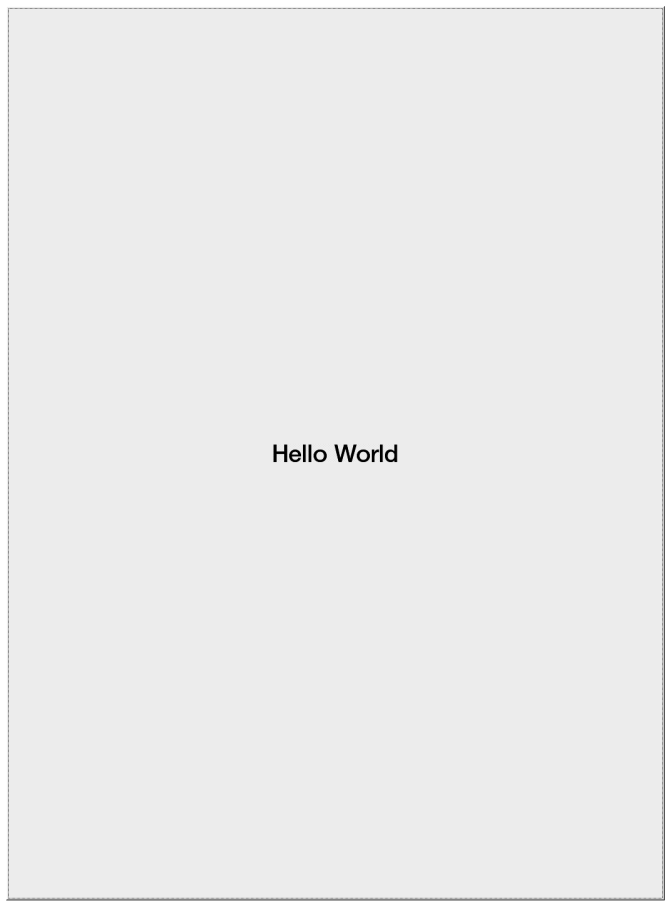
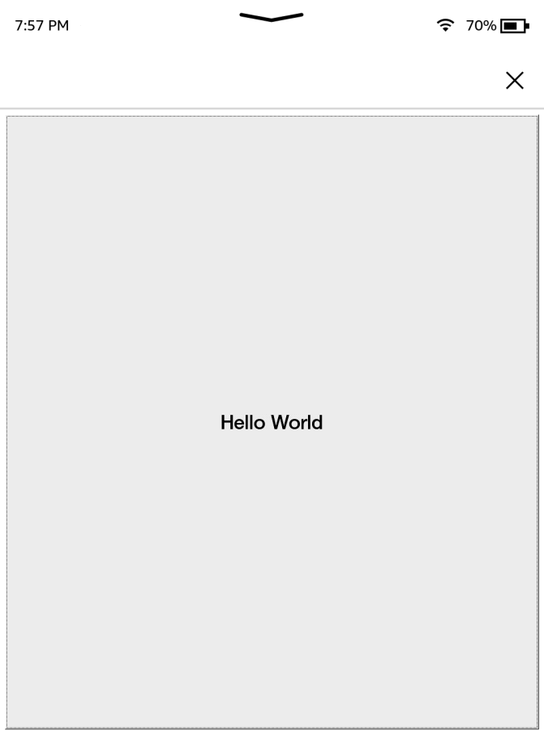
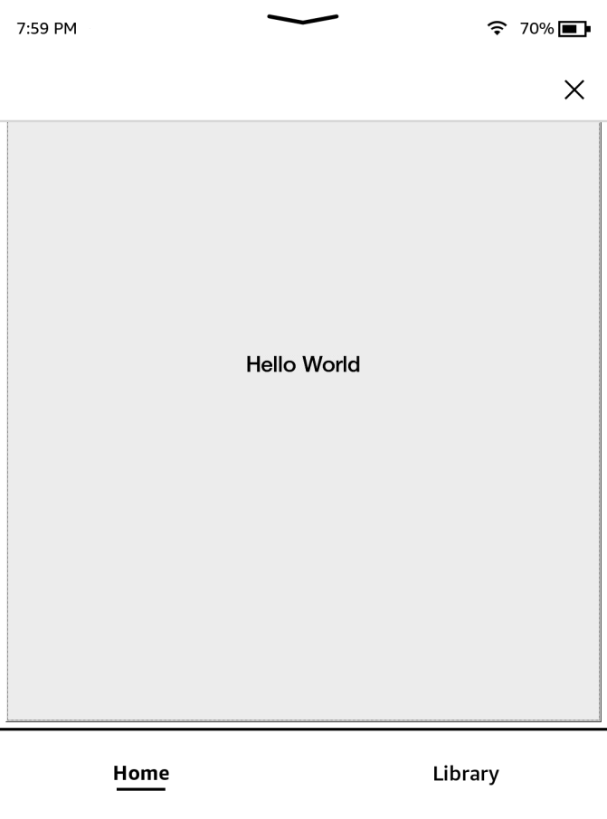

<style>
    img {
        max-height: 30vh;
        object-fit: scale-down;
    }
</style>

# Awesome Window Manager
As mentioned in the [gtk-tutorial](../gtk-tutorial/), the Kindle uses the `Awesome Window Manager` with some tweaks, this means that every window must have a title which follows a specific format.

For example, the Kindle store has a window title of:
```
L:A_N:application_PC:TS_ID:com.lab126.store
```

Window titles are actually a key-value store, seperated by an `_` character, this means the above title, would translate roughly to pseudo-JSON as:
```json
{
    "L":"A",
    "N":"application",
    "PC":"TS",
    "ID":"com.lab126.store"
}
```

Below is a list of every key and what it's role is:
## [L]ayer
The `L` flag is what layer the window should display on, it can be one of 5 values:

| Value | Description               |
|-------|---------------------------|
| `A`   | The `APP` layer           |
| `C`   | The `CHROME` layer        |
| `D`   | The `DIALOG` layer        |
| `KB`  | The `KB` (keyboard) layer |
| `SS`  | The `SCREENSAVER` layer   |

Layers are displayed from top to bottom, with applications on the `SCREENSAVER` layer being above applications on the `APP` layer.

Generally you will only be using the `A` and `D` layer values.


## [N]ame
lab126 internally refers to this as the "name/role" of the window, in reality it only represents the role of the window, and should be one of the listed values:

| Value          | Description                                                                                      |
|----------------|--------------------------------------------------------------------------------------------------|
| `application`  | For use with the `A` layer, application windows                                                  |
| `dialog`       | For use with the `D` layer, dialog windows                                                       |
| `titlebar`     | For backwards compatability,                                                                     |
| `tiledBottom`  | [SHOULD NOT BE USED IN PRODUCTION - lab_126.application_layer.lua:255]                           |
| `searchResult` | For use with the `C` layer, seemingly used for search result displays, acts as a modified dialog |
| `pillowAlert`  | An alert created by Pillow, for use with the `D` layer, blocks the home button                   |
| `titleBar`     |                                                                                                  |
| `footerBar`    |                                                                                                  |
| `topBar`       | Seemingly used for custom search bar apps (use with `BARTYPE` parameter)                         |
| `mediaBar`     |                                                                                                  |
| `bottomBar`    | REDUNDANT - use `topBar` role with `BARTYPE` of `B`                                              |
| `appToolBar`   | REDUNDANT - use `topBar` role with `BARTYPE` of `A`                                              |
| `keyboard`     | Used by the Kindle's keyboard                                                                    |
| `keyboardExt`  |                                                                                                  |
| `activeSS`     |                                                                                                  |
| `screenSaver`  |                                                                                                  |
| `searchBar`    | Used by the Kindle's top bar                                                                     |

You will generally only use `application` and `dialog` for this, in conjunction with the `A` and `D` layers


## [PC] (Persistent Chrome)

Used by the window manager to determine how to handle displaying chrome elements on the Kindle such as the top bar and "search bar"<br/>
It's value is any combination of the following:<br/>

| Value | Description                                                                                         | Example                        |
|-------|-----------------------------------------------------------------------------------------------------|--------------------------------|
| `T`   | Show the Kindle top bar/status bar on modern firmware                                               | |
| `S`   | Shows the "search bar"                                                                              | |
| `B`   | Shows the legacy bottom bar                                                                         | |
| `N`   | Show no bars (same as if `PC` was ommited entirely)                                                 | |

Examples of combining multiple PC values:

| Value | Image                            |
|-------|----------------------------------|
| `TS`  |  |
| `TSB` | |

<blockquote class="note">
Window resizing appears to be broken in `TSB`, it is only shown for illustrative purposes and shouldn't be used
</blockquote>

## [ID] (Identifier)
This is a simple string giving the identifier of the app, it's value can be anything not containing an underscore (as that is used as a delimiter) and it usually takes an app ID in a format similar to `com.lab126.reader` (reverse domain name)

Note that the value `blankBackground` is reserved, it's purpose is currently unknown but it makes an app `invalid`

## [BARTYPE]
BARTYPE is used with the`topBar` role type, it describes the bar's positioning and takes one of the following values:

| Value | Description                                                                                         |
|-------|-----------------------------------------------------------------------------------------------------|
| `T`   | Top bar type                                                                                        |
| `S`   | Search bar type                                                                                     |
| `B`   | Bottom bar type -  "added for kpp chrome footer" - It behaves like top bars in terms of persistence |
| `A`   | Application bar type - Secondary bar for application specific tools                                 |

## [O]rientation - Supported App Orientations
Sets the application's orientation mask for supported orientations, can be any combination of 4 values (IE: `ULR` or `UDLR`):

| Value | Description |
|-------|-------------|
| `U`   | Up          |
| `D`   | Down        |
| `L`   | Left        |
| `R`   | Right       |

## [HIDE]
A flag that can be set to hide the window, the title can be updated without it to show the window

IE:
```
L:A_N:application_HIDE_ID:org.kindlemodding.hiddenwindow
```

Note that this flag can take an optional value of `background` which means this window does not take focus. (actual purpose unknown)

## [RC] - Rounded Corners
For use with dialogs, can be used to set rounded corners on a dialog, it can be used as a flag or given an integer value representing the corner radius in pixels of all the corners.

It can also be given the value `custom`, where any combination of the following 4 keys can be used to set a corner radius for the window:
- `RCTL`
- `RCTR`
- `RCBL`
- `RCBR`

Example, setting rounded corners only on the top-left and top-right corners to the default rounded corner radius:
```
RC:custom_RCTL_RCTR
```

## [M]odality
Used specifically for dialogs, if this flag is present, it dictates the dialog is a modal.
It can have an optional value of `dismissible`, ie:
```
L:A_N:application_M:dismissable_ID:org.kindlemodding.hiddenwindow
```

## [RKB] - Require KeyBoard
Used specifically for dialogs that require the keyboard, this positions the dialog so that it does not clip with the spawned keyboard.
It can seemingly take a numeric value of unknown purpose.

## [PALMR] - Palm Rejection
Purpose unknown - only used in conjunction with `M:dismissable`, seemingly related to palm rejection on dismissal

