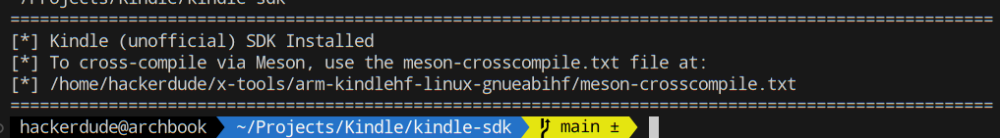

# Prerequisites
You will need to be running a Linux operating system* or WSL/msys2 under Windows<br/>
*MacOS is untested but may work

You will need a jailbroken Kindle and you will need to know what firmware your Kindle is running on.

You will also need to compile a toolchain targetting your device, the details of which are explained further on this page.

You will also need the following packages installed on your system for the toolchain:
- git
- ncurses
- gperf
- help2man
- bison
- texinfo
- flex
- gawk
- unzip
- wget

As well as `curl` and `sed` installed for the SDK

And specifically for this tutorial:
- meson
- gtk2 (with development headers)
- compilation tools

## Installing The Required Packages
### For Arch Linux
```sh
# For the toolchain
sudo pacman -S base-devel curl git gperf help2man unzip wget

# For the SDK
sudo pacman -S curl sed libarchive nettle

# For this tutorial
sudo pacman -S meson gtk2
```

### For Debian/Ubuntu
```sh
# For the toolchain
sudo apt-get install build-essential autoconf automake bison flex gawk libtool libtool-bin libncurses-dev curl file git gperf help2man texinfo unzip wget

# For the sdk
sudo apt-get install curl sed libarchive-dev nettle-dev

# For this tutorial
sudo apt-get install meson gtk2.0 libgtk2.0-dev
```

## Building The Toolchain

<blockquote class="note">
If you don't want to build the toolchain yourself or if you encounter difficulties in building it, use the [pre-built release](https://github.com/koreader/koxtoolchain/releases/latest)
</blockquote>

#### 1. Clone the toolchain
```sh
git clone --recursive --depth=1 https://github.com/koreader/koxtoolchain.git
```

#### 2. Build the toolchain for your device
```sh
cd koxtoolchain
chmod +x ./gen-tc.sh
./gen-tc.sh <target>
```

Where target should be replaced as follows:

|     TC    |              Supported Devices              |               Target             |
|:---------:|:-------------------------------------------:|:--------------------------------:|
|   kindle  |             Kindle 2, DX, DXg, 3            | [not supported by this tutorial] |
|  kindle5  |             Kindle 4, Touch, PW1            | [not supported by this tutorial] |
| kindlepw2 | Kindle PW2 & everything since on FW <5.16.3 |             kindlepw2            |
|  kindlehf |          Any Kindle on FW >= 5.16.3         |              kindlehf            |

<blockquote class="note">
If you want to support multiple Kindles, you can compile multiple toolchain targets just by running `./gen-tc.sh <other_target>` and the new toolchain be added to your `~/x-tools` directory
</blockquote>

<blockquote class="note">
Compilation usually takes around 30-minutes per target on most PCs
</blockquote>

## Setting up the SDK

The KMC Kindle SDK augments your existing koxtoolchain installation by providing headers and library files used with the Kindle.

#### 1. Clone the SDK
```sh
git clone --recursive --depth=1 https://github.com/KindleModding/kindle-sdk.git
```

#### 2. Install the SDK for your target
```sh
cd kindle-sdk
chmod +x ./gen-sdk.sh
./gen-sdk.sh <target>
```
Where `<target>` is the same as the toolchain you want to install the SDK for.


Once the SDK has finished installing itself, make a note of the path it returns to the `meson-crosscompile.txt` file, this will be important later!
