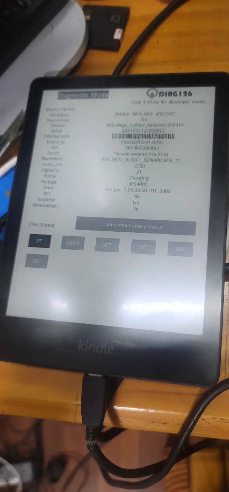

# Prototype Kindles
> [!NOTE]
> Special thanks to scam.net, Marek and Ygjsz for researching and obtaining some of these devices

Below is a collection of prototype Kindle images from the internet

    
    
    
    
    
    
    
    
    

Like everything, there exist developer-only versions of Kindles - surprisingly, however, some of our team have been able to find and purchase them!  
This is where utilities such as `screenControl` came from!  

Developer firmware comes with the `/app/tools` folder which contains internal-use tools from `lab126` - most interestingly, the firmware comes bundled with `kterm`.

## Developer Firmware Downloads

[https://hackerdude.tech/vault/kindle-firmwares/scribe_diags_full_dump.7z](./scribe_diags_full_dump.7z) - Dumped by `Ygjsz`

[https://hackerdude.tech/vault/kindle-firmwares/PW5_Dev_5.14.0_3741660014_initialdumpfromlinux.img.xz](PW5_Dev_5.14.0_3741660014_initialdumpfromlinux.img.xz) - Dumped by `scam.net`