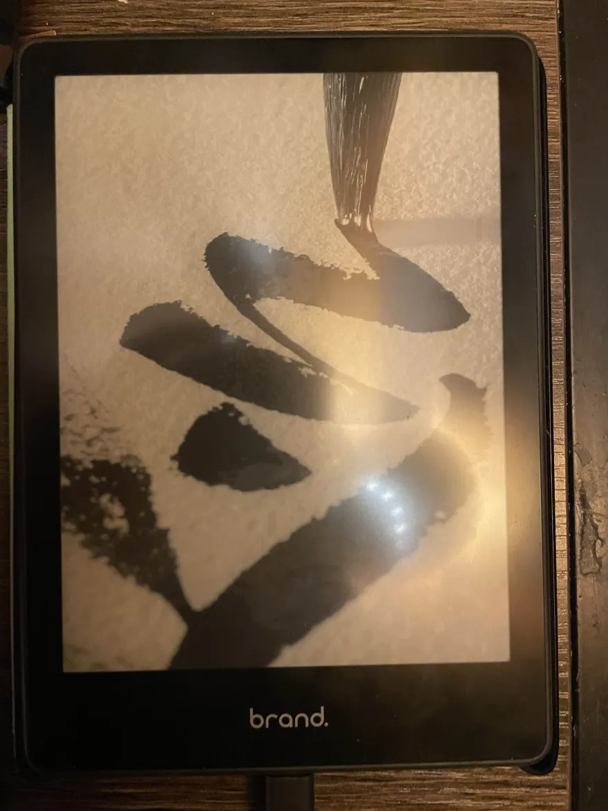
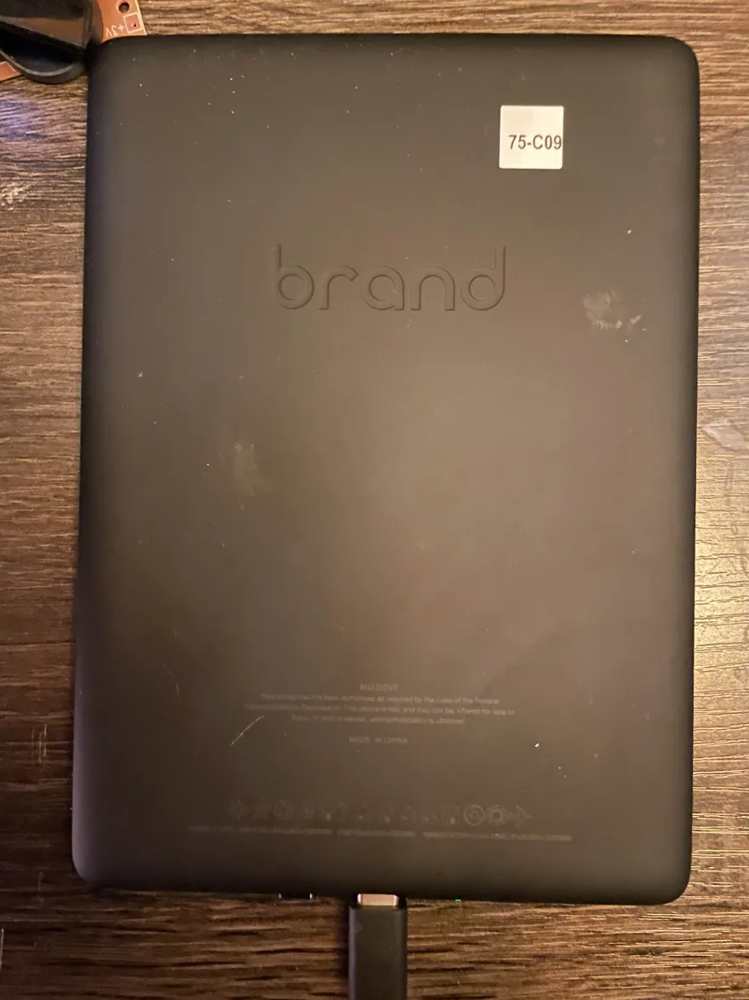

# Prototype Kindles
<blockquote class="note">
    Special thanks to scam.net, Marek and Ygjsz for researching and obtaining these devices
</blockquote>

Like everything, there exist developer-only versions of Kindles - surprisingly, however, some of our team have been able to find and purchase them!  
This is where utilities such as `screenControl` came from!  

Developer firmware comes with the `/app/tools` folder which contains internal-use tools from `lab126` - most interestingly, the firmware comes bundled with `kterm`.