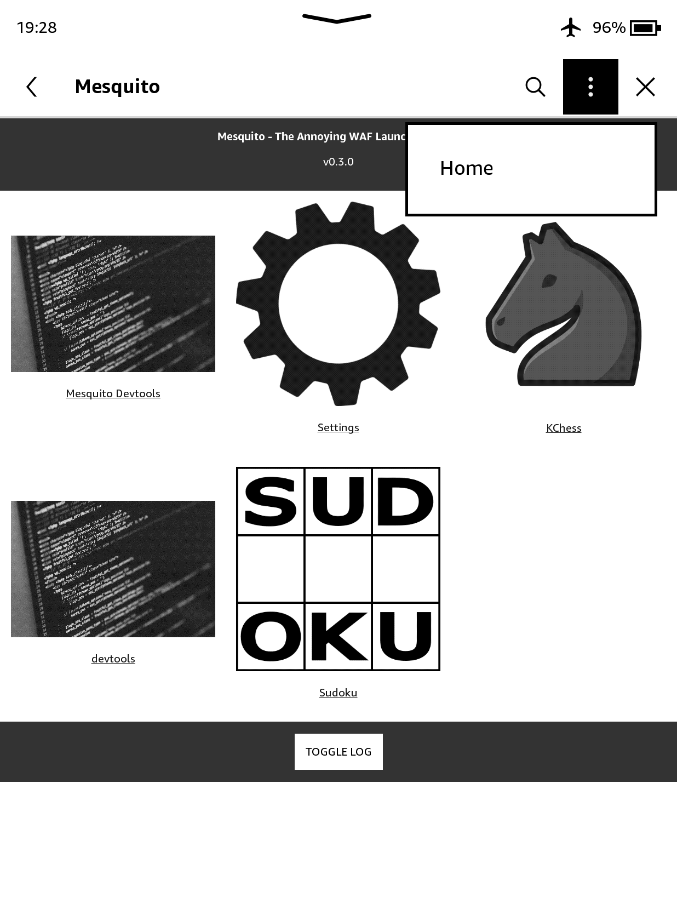

# Mesquito
Mesquito is a simple WAF loader designed to replace the Kindle store on Kindles. Mesquito is extremely simple to install and runs on all firmwares below 5.18.

## Installation
1. Download the latest [release](https://github.com/KindleModding/Mesquito/releases/latest)
2. Place your Kindle into airplane mode
3. Plug your Kindle into your PC
4. Extract the `zip` file you downloaded to the root of your Kindle
5. Replace any files if prompted
6. Reboot your Kindle
7. Open the Kindle Store
8. When prompted, turn on WiFi
9. Done!

<blockquote class="warning">
Make sure you turn on Airplane mode to stop the Kindle getting an OTA update that could break Mesquito!
</blockquote>

## Post-Installation
A collection of Mesquito apps are available [here](https://github.com/KindleModding/KindleModding-Apps)
Simply download the [latest release](https://github.com/KindleModding/Mesquito/releases/latest) and copy the apps you want to the `apps` folder on your Kindle and re-load Mesquito by `clicking on the 3 dots` > `Home`

## Development
See [Developing For Mesquito](../mesquito/development/)

## Screenshot Of Mesquito

