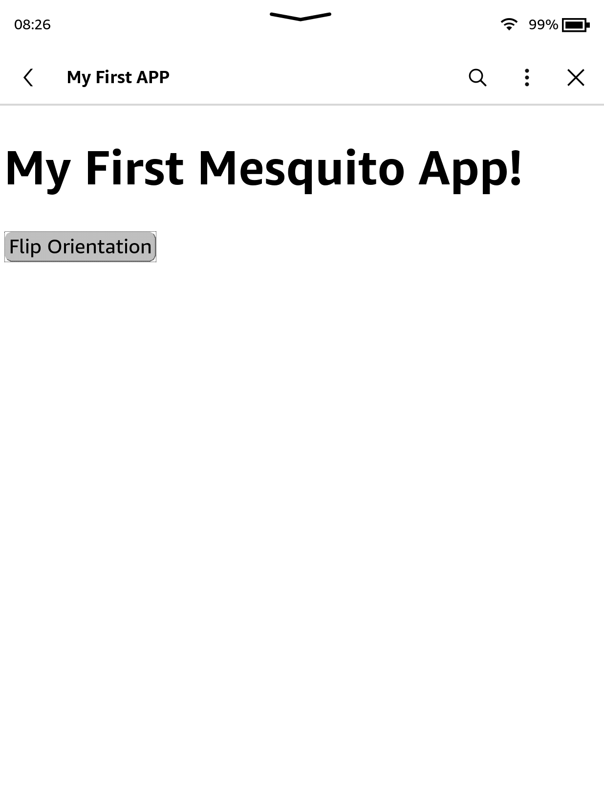

# Your First App
Assuming you have read all the other sections, this tutorial will go over how you can create your own functioning Mesquito WAF.

## Creating the folder
Either on a safe place in your PC or in the `apps/` folder of your Kindle, create a new folder, call it `com.mesquito.firstapptutorial`, this will store our app data

## Creating the manifest file
Within that folder, create a `manifest.json` as so:
~~~json
{
  "minVersion": 2,
  "manifestVersion": 2,
  "appVersion": "v1.0.0",
  "waf": true,
  "id": "com.mesquito.firstapptutorial",
  "name": "My First App!",
  "author": "tutorial",
  "description": "Tutorial App",
  "repo": "https://example.com",
  "icon": "icon.png",
  "entrypoint": "index.html"
}
~~~

The manifest file tells Mesquito all the information it needs to load the app.

## Creating the index.html file
As hinted by the `payload` key of the `manifest`, the app will need an `index.html` file to work with, simply create one in the folder and insert the following contents:
~~~html
<!DOCTYPE HTML>
<html>
<head>
  <meta name="viewport" content="user-scalable=no"/>
  
  

  
  <link href="./main.css" rel="stylesheet">

  <title>My First APP</title>
</head>
<body>
  <h1>My First Mesquito App!</h1>

  <button id="myButton" onclick="buttonClick()">Flip Orientation</button>
</body>
</html>
~~~
This will display a simple webpage but won't do anything itself, that's because we still need to add some code!

## Adding some Javascript
Create a new file, call it `main.js`, this will store all the code for the app, you can insert the following contents:
~~~js
var flipped = false;

function buttonClick() {
    if (flipped) {
        kindle.device.setOrientation("portraitUp");
        flipped = false;
    } else {
        kindle.device.setOrientation("portraitDown");
        flipped = true;
    }
}
~~~
This code will use the [`setOrientation`](../../wafs-and-mesquite/the-kindle-object/kindle-device.html#kindledevicesetorientation) function to flip the orientation of the screen at the press of the button.

## Adding some style
The app would still look quite basic at this stage, so we need to give it some style! Simply create a file called `main.css` and insert the following content:
~~~css
button {
  border-radius: 15px;
}
~~~

<blockquote class="warning">
You should **NEVER** use relative units when developing for a Kindle, as pixel units are more consistent accross models
</blockquote>

## Testing it out
If you haven't already, copy the `com.mesquito.firstapptutorial` folder to your `apps` folder, reload Mesquito by clicking on the `three dots` and then `Home`, and open your app:

## Next steps
You saw how we can use the WAF API within a Mesquito app to affect the device to an extent, feel free to read the [`kindle object`](../../wafs-and-mesquite/the-kindle-object/) for more information!