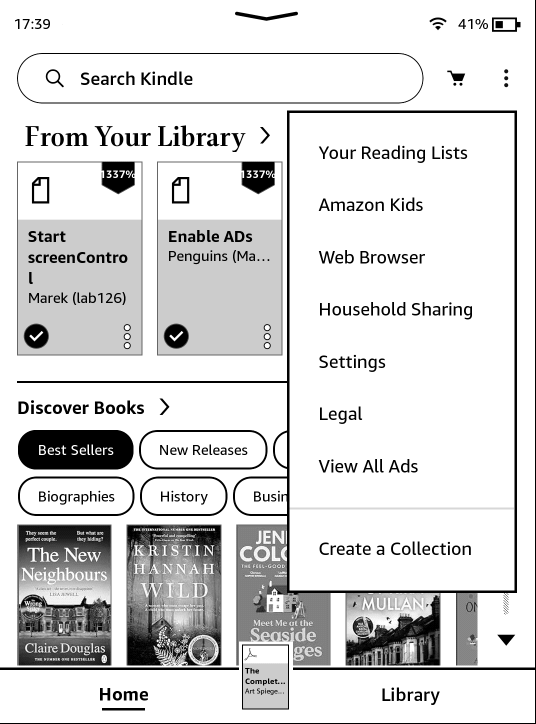
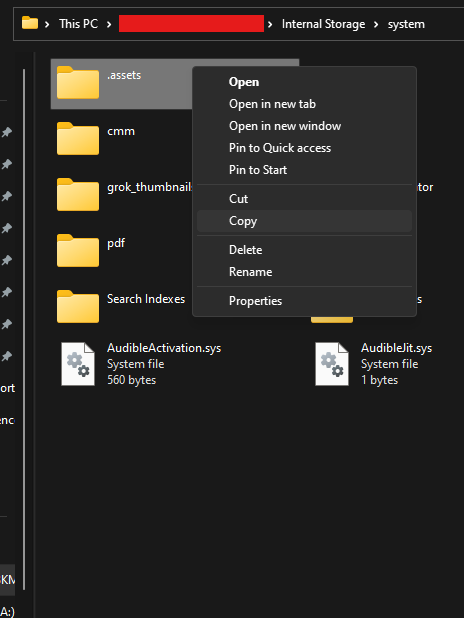
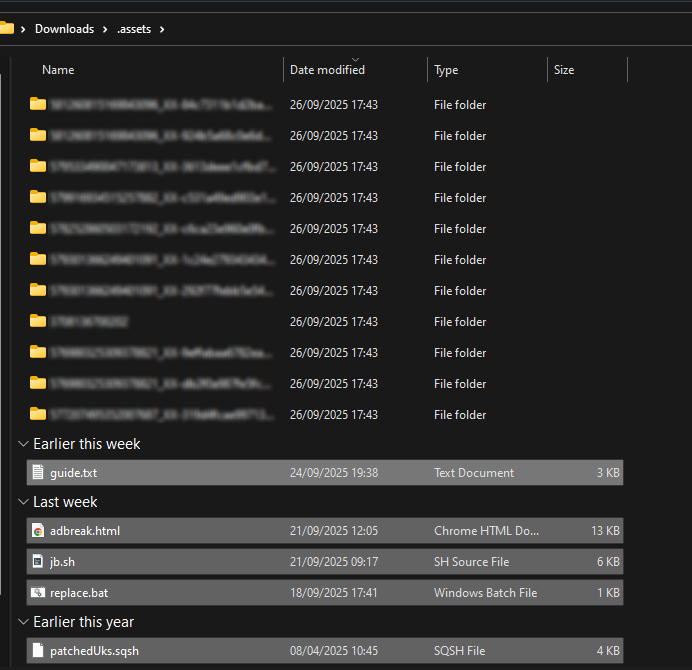
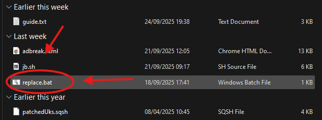
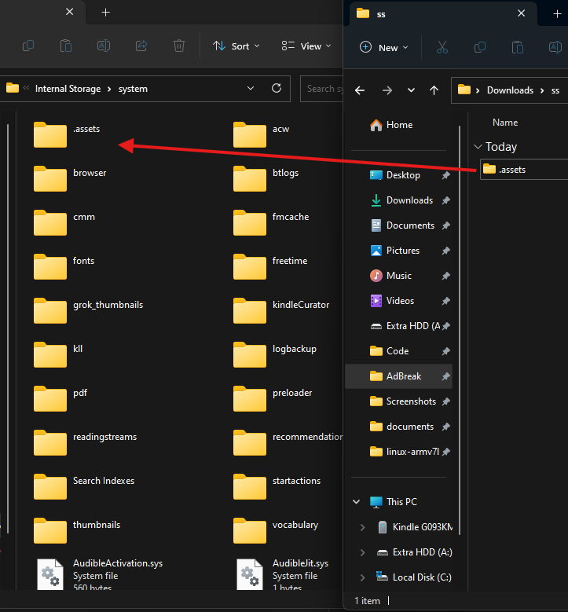
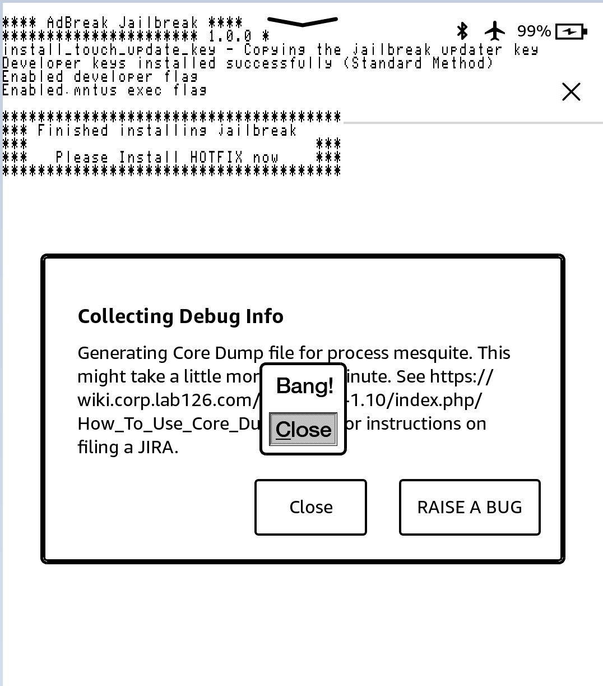

# AdBreak

> If I cannot do great things, I can do small things in a great way.
>  
> \- Martin Luther King, Jr.

AdBreak is a jailbreak released on 24/09/2025 by hhhhhhhhh.

It is based on [CVE-2012-3748](https://scarybeastsecurity.blogspot.com/2017/05/ode-to-use-after-free-one-vulnerable.html).

{: .note}
> Scribe devices must be using a French account to enable ads

{: .note}
> Special thanks to Chris Evans (@scarybeasts) for a lot of the exploit code, hackerdude for the modified JB script.

## Prerequisites

- You will need a PC, cable
- Non-blacklisted, registered, ad-enabled Kindle
- Firmware 5.18.1 and above (possibly patched after 5.18.5.0.1)

{: .info}
If you face any issues, please check the [troubleshooting](#troubleshooting) section. It also includes details on how you could possibly re-enable ads on a kindle which does not have them at present.

## Installation Guide

    

        <button class="btn btn-orange" id="prev">Previous Step</button>
        
        <button class="btn btn-green" id="next">Next Step</button>
    

    

        

            <h2>Download the latest AdBreak release:</h2>
            

                <a href="https://github.com/htimesnine/AdBreak/releases/download/v1.0.1/adbreak.zip" class="btn btn-purple">Download</a>
                

                    If your Kindle is <b>is not yet registered</b>, make sure to follow <a href="../prevent-auto-update.html">these steps to prevent your Kindle from automatically updating</a> before registering your device with Amazon. This will help you avoid an automatic firmware update during the registration process.
                

                

                    Please use WinterBreak on firmware <code>5.18.0.2</code> and below.
                

            

        

        

            <h2>Download Ads</h2>
            

                
Leave your kindle for a while, connected to the internet, so it can download advertisements.   If you press the lock button, an advertisement should be displayed.   If advertisements aren't being downloaded after a while, a factory reset may help.

            

        

        

            <h2>Aeroplane Mode</h2>
            

                
Once you have verified ads are displayed on the lockscreen, enable airplane mode.

                 
            

        

        

            <h2>View all ads</h2>
            

                
Click on the top right menu and select "View all ads", which should display multiple "special offers".

                
            

        

        

            <h2>Copy .assets</h2>
            

                
Plug in the Kindle, open the system folder and copy the ".assets" folder to your computer.

                
            

        

        

            <h2>Unzip AdBreak</h2>
            

                
Unzip the previously downloaded AdBreak, and place the extracted contents within the ".assets" folder located on your computer.

                
            

        

        

            <h2>Run The Replace Script</h2>
            

                

                    
Windows:

                    
Double-click on "replace.bat" to run it.

                

                

                    
MacOS/Linux:

                    
Run <code> find . -name 'details.html' -exec cp adbreak.html {} \;</code> using a terminal.

                

                
            

        

        

            <h2>Replace Kindle .assets</h2>
            

                
Delete the original kindle <code>.assets</code> and replace it with your on-PC modified copy.

                
            

        

        

            <h2>Jailbreak!</h2>
            

                
Unplug, click on an ad and go through the popups, once you click Close on "Bang!", the jailbreak script should run.

                

                    You can safely ignore any "application error" popups, they are irrelevant.
                

                
            

        

    

    

        <button class="btn btn-orange" id="prev">Previous Step</button>
        
        <button class="btn btn-green" id="next">Next Step</button>
    

## Troubleshooting

### FAQ

- The JB does NOT automatically remove advertisements, see Marek's scriptlet.
- It will never work on the CS/Colorsoft! Ads can NOT be re-enabled there!
- No, this is not "UJ"/"Unnamed Jailbreak". That is separate.
- "Is there a way to make my device ad supported?" (see below)

### Common Issues

- Can't find the system folder:
    - On mass storage kindles, **if you cannot see the `system` folder**, you will have to navigate to the path manually, or follow [this](https://kb.blackbaud.com/knowledgebase/Article/41890) guide to see protected system folders. 
- "Bang!" shows but the jailbreak doesn't run:
    - Check the .assets folder on the Kindle. "jb.sh" and "patchedUks.sqsh" must be in there.

### Enabling Ads
(needed for jailbreak, safe to remove later)

- Switch account region  
   - Go to Manage Your Content and Devices → Preferences → Country/Region Settings → Change.  
   - Select one of: US, UK, DE, FR, IT, ES, JP, CN, AU  
   - Use valid details (address, phone, email).

- Add payment method  
   - Set a default credit card and billing address matching the chosen region.  
   - No charge should occur.

- Enable special offers  
   - In your Amazon account, turn on Special Offers for your Kindle.

- Sync kindle  
   - Connect to Wi-Fi, eventually ads will appear on lockscreen.

Notes:  
- If your kindle originally had no ads, re-disabling later is free.  
- If your kindle is an ads model, disabling normally costs a one-time fee, but can be removed post-jb with a script.  

## Special Thanks

- Penguins184: This guide
- Ceoz: Enable-ad findings
