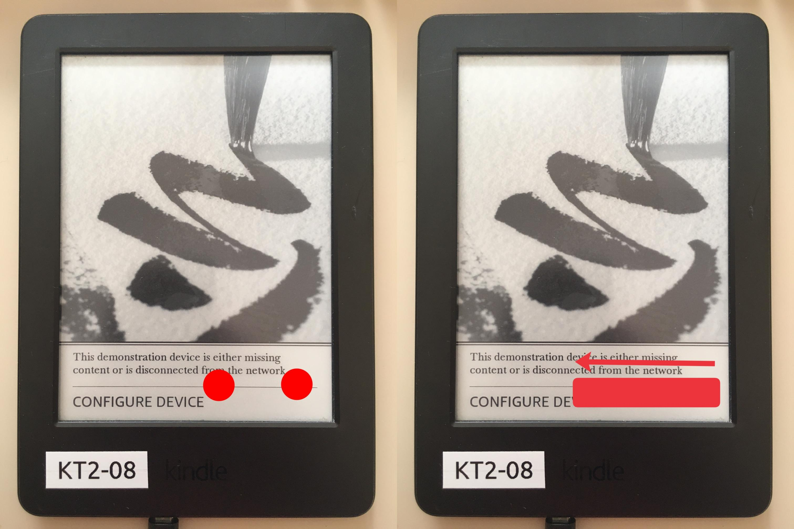

# LanguageBreak
<a href='https://ko-fi.com/notmarek' target='_blank'>

[LanguageBreak](https://www.mobileread.com/forums/showthread.php?t=356872) is jailbreak utilising a novel [`langpicker-nativebridge`](https://www.mobileread.com/forums/showthread.php?t=356766) exploit.

## Prerequisites
- Please check that your Kindle is [compatible](../getting-started.html) with LanguageBreak
- You will also need a PC

{: .warning}
LanguageBreak will **NOT** work on firmwares newer than `5.16.2.1.1`

## Jailbreaking Your Kindle

### Downloading prerequisites
1. Download LanguageBreak from [here](https://github.com/notmarek/LanguageBreak/releases/latest)
2. Extract the `tar.gz` file to somewhere safe on your computer

### Entering demo mode
### Initial setup
1. Factory reset your Kindle
2. On the language selection screen, select any language
3. Skip Wi-Fi registration by selecting any network and then backing out
4. Type `;enter_demo` into the Kindle's searchbar an click enter
5. Reboot the Kindle by holding down the button and selecting the `reboot` option when it appears
6. The device should now boot into demo mode, if it doesn't, check the [Troubleshooting](#troubleshooting) section
7. Skip WiFi setup and enter fake information when prompted
8. Skip searching for a demo payload
9. Select the `standard` demo type
10. Press `Done` at the "sideload content" prompt
11. Once that is done, you can byass the `misconfiguration` error using the following gesture:

(tap with two fingers, then swipe left)
12. In the searchbar, type `;demo` and click enter
13. Select the "sideload content" option

### Sideloading the content
1. Connect the Kindle to your PC
2. Copy the contents of the LanguageBreak folder to the Kindle - merging and replacing all files
3. Eject and Unplug your kindle and go back to the demo menu
4. Select the "Resell Device" option
5. Choose `Yes/Resell`
6. Now wait for the `press power button` message to show
7. As soon as it appears plug your kindle back to your computer and copy the contents of the LanguageBreak folder into it once again, overwrite files then safely eject
8. Hold the power button as instructed on screen
9. You should be in a language selection menu in a few seconds
10. Choose Chinese (The second-last one on the `right` list, above `p s e u d o t`)
11. Your kindle should reboot and you should see some log message on the screen
12. The device is now in a jailbroken state

### Install LanguageBreak-Specific Hotfix
{: .note}
> LanguageBreak is unique in the sense that its own `HotFix` must be installed before proceeding with other `Post Jailbreak` items

1. Type `;uzb` into the search bar of your Kindle and click enter
2. Connect the Kindle to your PC
3. Copy the `update_hotfix_languagebreak.bin` from the LanguageBreak `tar.gz` you extracted during setup to the root of your Kindle
4. Eject and unplug the Kindle
5. Enter `;dsts` into the search bar of the Kindle and click enter
6. Select `Update Your Kindle`

You are now ready to check the `Post Jailbreak` section for what to do now.

[Post Jailbreak](../post-jailbreak/){: .btn .btn-purple}

# Troubleshooting
If you had any issue with the above steps...

## Alternative Demo Mode entry method
1. Plug the Kindle into your PC
2. Create an empty file named `DONT_CHECK_BATTERY` at the root of your Kindle
3. Activate demo mode by typing `;demo` into the search bar and clicking enter
4. Continue from `step 5` of `Initial setup`

## Resetting whilst in Demo Mode
If you need to reset your device whilst in demo mode
1. Enter `;uzb` in the search bar and click enter
2. Plug the Kindle into your PC
3. Create an empty file at the root of the Kindle called `DO_FACTORY_RESTORE`
4. Reboot the Kindle

## Secret Gesture Video
[this video](https://www.youtube.com/watch?v=JzuIGbGPpig) shows how to perform the misconfiguration bypass gesture

## Credits
- [LanguageBreak](https://www.mobileread.com/forums/showthread.php?t=356872) created by [Marek](https://www.mobileread.com/forums/member.php?u=340787)
- Original [`langpicker-nativebridge`](https://www.mobileread.com/forums/showthread.php?t=356766) exploit discovered by [GeorgeYellow](https://www.mobileread.com/forums/member.php?u=288138) and [bulltricks](https://www.mobileread.com/forums/member.php?u=335985)