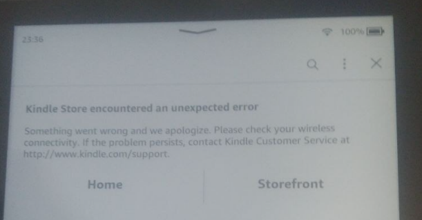

# WinterBreak
<a href='https://ko-fi.com/hackerdude' target='_blank'>

WinterBreak is a jailbreak which was released on New Year's Day 2025 by [HackerDude](https://www.mobileread.com/forums/member.php?u=330416)

It is based on [Mesquito](../../mesquito/)

{: .highlight}
> Special thanks to Marek, NiLuJe, Katadelos and all the beta-testers during the development of this jailbreak.
>
> RIP bricked Kindles during beta-testing
> RIP the original deadlines

## Installation Guide
1. Download the latest WinterBreak release:
 
[Download WinterBreak](https://github.com/KindleModding/WinterBreak/releases/latest){: .btn .btn-purple}
2. Turn on aeroplane mode on your Kindle
3. Plug the Kindle into your computer
4. Extract the contents of the `WinterBreak.tar.gz` file to your Kindle
5. Eject your Kindle from your computer
6. Reboot your Kindle
7. Open the Kindle Store on your Kindle
8. When prompted, click `yes` to turn off airplane mode

9. Click on the WinterBreak icon when it loads:

10. Wait around 30 seconds, and your Kindle will automatically reboot as shown:

You are now ready to check the `Post Jailbreak` section for what to do now.

[Post Jailbreak](../post-jailbreak/){: .btn .btn-purple}

## Kindle store encountered an unexpected error
> Faced this error and found a solution [DiabloSat](https://github.com/progzone122) & [Rexathion1](https://github.com/Rexathion1)

If an **“Unexpected error” error** occurs when you try to log in to the Kindle Store or **only the Kindle Store home page** is displayed, try the following solution:

1. Factory Reset Kindle
2. Before logging into your account - plug your Kindle into your PC, move the WinterBrake files to the root of your storage space
3. Log in account and enter airplane mode as soon as possible
4. Connect Kindle to PC and delete the cache directory at the path .active_content_sandbox/store/resource/LocalStorage (Skip this step if the LocalStorage directory does not exist)
5. Reboot Kindle
6. Open the Kindle Store on your Kindle
7. When prompted, click `yes` to turn off airplane mode

### Special Thanks To Beta Testers
- Crystals (Bricked their PW4 testing)
- mergen3107 (Came up with the "WinterBreak" name)
- Bomberfish
- BionicGecko
- Juliet
- Rie
- Robotic
- scrad
- shamanNS
- akane
- BlackNinja
- Gimzie
- Human
- Lux
- Marek
- terra