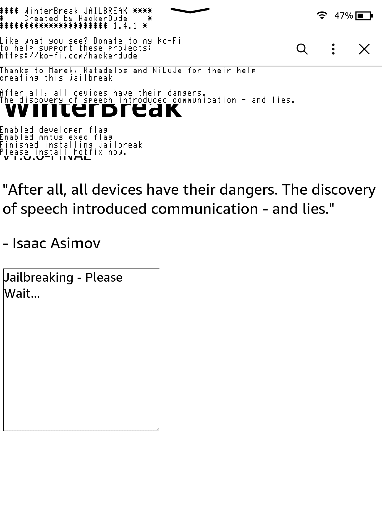

# WinterBreak
<a href='https://ko-fi.com/hackerdude' target='_blank'>

WinterBreak is a jailbreak which was released on New Year's Day 2025 by [HackerDude](https://www.mobileread.com/forums/member.php?u=330416)

It is based on [Mesquito](../../mesquito/)

{: .highlight}
> Special thanks to Marek, NiLuJe, Katadelos and all the beta-testers during the development of this jailbreak.
>
> RIP bricked Kindles during beta-testing
> RIP the original deadlines

## Installation Guide
1. Download the latest WinterBreak release:
 
[Download WinterBreak](https://github.com/KindleModding/WinterBreak/releases/latest){: .btn .btn-purple}
2. Turn on aeroplane mode on your Kindle
3. Plug the Kindle into your computer
4. Extract the contents of the `WinterBreak.tar.gz` file to your Kindle ( Note: For Windows / macOS users , Ensure that hidden folders are also copied over )
5. Eject your Kindle from your computer
6. Reboot your Kindle
7. Open the Kindle Store on your Kindle
8. When prompted, click `yes` to turn off aeroplane mode

9. Click on the WinterBreak icon when it loads:

10. Wait around 30 seconds, and your Kindle will automatically reboot as shown:

You are now ready to check the `Post Jailbreak` section for what to do now.

[Post Jailbreak](../post-jailbreak/){: .btn .btn-purple}

### Special Thanks To Beta Testers
- Crystals (Bricked their PW4 testing)
- mergen3107 (Came up with the "WinterBreak" name)
- Bomberfish
- BionicGecko
- Juliet
- Rie
- Robotic
- scrad
- shamanNS
- akane
- BlackNinja
- Gimzie
- Human
- Lux
- Marek
- terra
