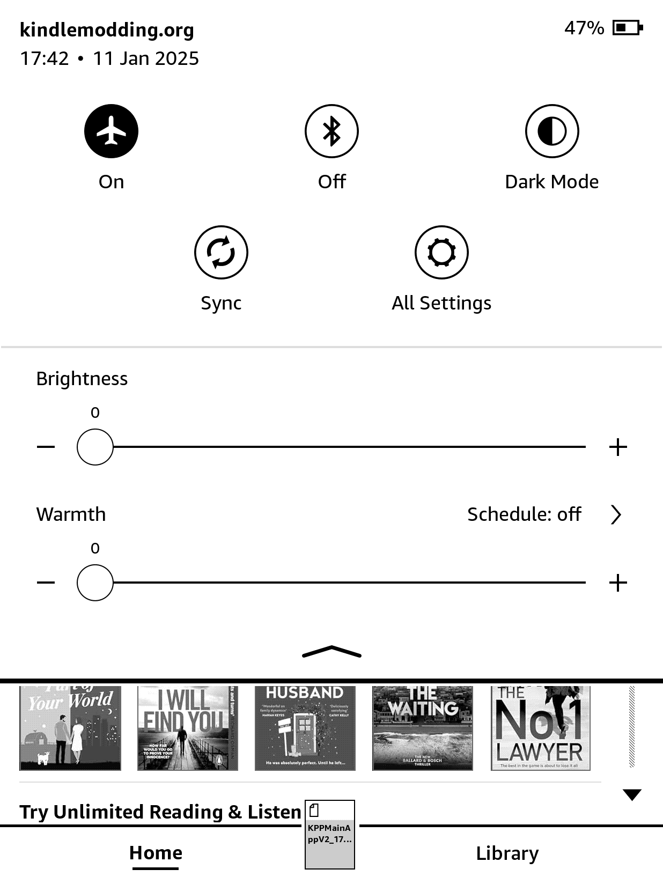
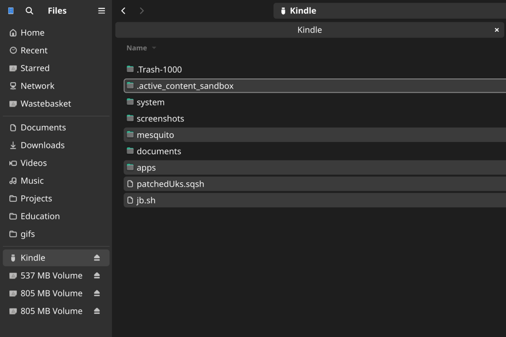

# WinterBreak
<a href='https://ko-fi.com/hackerdude' target='_blank'>

> After all, all devices have their dangers. The discovery of speech introduced communication – and lies.
>  
> \- Isaac Asimov

WinterBreak is a jailbreak which was released on New Year's Day 2025 by [HackerDude](https://www.mobileread.com/forums/member.php?u=330416)

It is based on [Mesquito](../../mesquito/)

{: .highlight}
> Special thanks to Marek, NiLuJe, Katadelos and all the beta-testers during the development of this jailbreak.
>
> RIP bricked Kindles during beta-testing
>  
> RIP the original deadlines

{: .warning}
Mesquio does NOT work on firmware `5.18.1` and beyond.

## Prerequisites
- You will need a PC
- Your Kindle must be registered
- Your Kindle must have a valid, internet-connected WiFi network saved to it that it can connect to during steps 8 to 10 (inclusive)

{: .highlight}
If you face any issues, please check the [troubleshooting](#troubleshooting) section

## Installation Guide

    

        <button class="btn btn-orange" id="prev">Previous Step</button>
        
        <button class="btn btn-green" id="next">Next Step</button>
    

    

        

            <h2>Download the latest WinterBreak release:</h2>
            

                <a href="https://github.com/KindleModding/WinterBreak/releases/latest/download/WinterBreak.tar.gz" class="btn btn-purple">Download</a>
            

        

        

            <h2>Airplane Mode</h2>
            

                
Turn on airplane mode on your Kindle

                
            

        

        

            <h2>Rebooting</h2>
            

                
Reboot your Kindle

                
            

        

        

            <h2>Extracting WinterBreak</h2>
            

                
Once it has booted, plug the Kindle into your computer and extract the contents of the `WinterBreak.tar.gz` file to a safe place on your computer

                
Then copy the files to your Kindle (do not extract direcly to the Kindle as this may fail)

                

                    For Linux/MacOS users, ENSURE the hidden folder `.active_content_sandbox` has been copied to your Kindle
                

                
                

                    Replace any files if you are prompted to
                

            

        

        

            <h2>Entering Mesquito</h2>
            

                
Eject the Kindle from your computer

                
Open the Kindle Store on your Kindle by clicking on the cart icon on the home screen

                
When prompted, click `yes` to turn off airplane mode

                
                
Once Mesquito has loaded you can re-enable Airplane mode.

            

        

        

            <h2>Running WinterBreak</h2>
            

                
Click on the WinterBreak icon when it loads:

                
            

        

        

            <h2>Done</h2>
            

                
Wait around 30 seconds, and your Kindle will say something along the lines of "Now you are ready to install the hotfix"

                
Once it does, turn airplane mode back on and you can move onto the post-jailbreak stage!

                

                    If you do not see any funky text then make sure Airplane mode is disabled - turn it back on after you see the text though!
                

                
            

        

    

    

        <button class="btn btn-orange" id="prev">Previous Step</button>
        
        <button class="btn btn-green" id="next">Next Step</button>
    

# Troubleshooting
## Kindle store encountered an unexpected error
> Faced this error and found a solution [DiabloSat](https://github.com/progzone122) & [Rexathion1](https://github.com/Rexathion1)

If an **“Unexpected error”** occurs when you try to log in to the Kindle Store or **only the Kindle Store home page** is displayed, try the following solution:

1. Factory Reset Kindle
2. Before registering your Kindle/logging into your account - plug your Kindle into your PC, move the WinterBreak files to the root of your storage space
3. Log in account and enter airplane mode as soon as possible
4. Connect Kindle to PC and delete the cache directory at the path .active_content_sandbox/store/resource/LocalStorage (Skip this step if the LocalStorage directory does not exist)
5. Reboot Kindle
6. Open the Kindle Store on your Kindle
7. When prompted, click `yes` to turn off airplane mode

# Special Thanks To Our Courageous Beta Testers
- Crystals (Bricked their PW4 testing)
- mergen3107 (Came up with the "WinterBreak" name)
- Bomberfish
- BionicGecko
- Juliet
- Rie
- Robotic
- scrad
- shamanNS
- akane
- BlackNinja
- Gimzie
- Elaine Roberts
- Lux
- Marek
- terra
