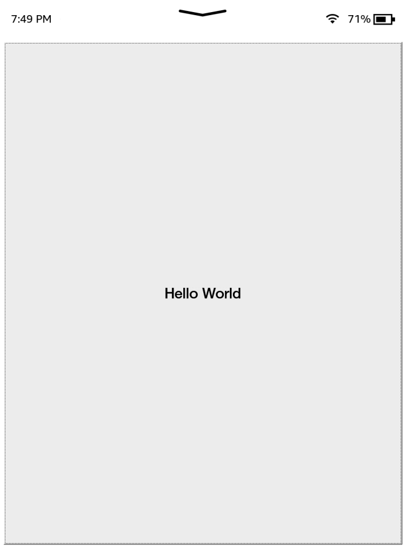
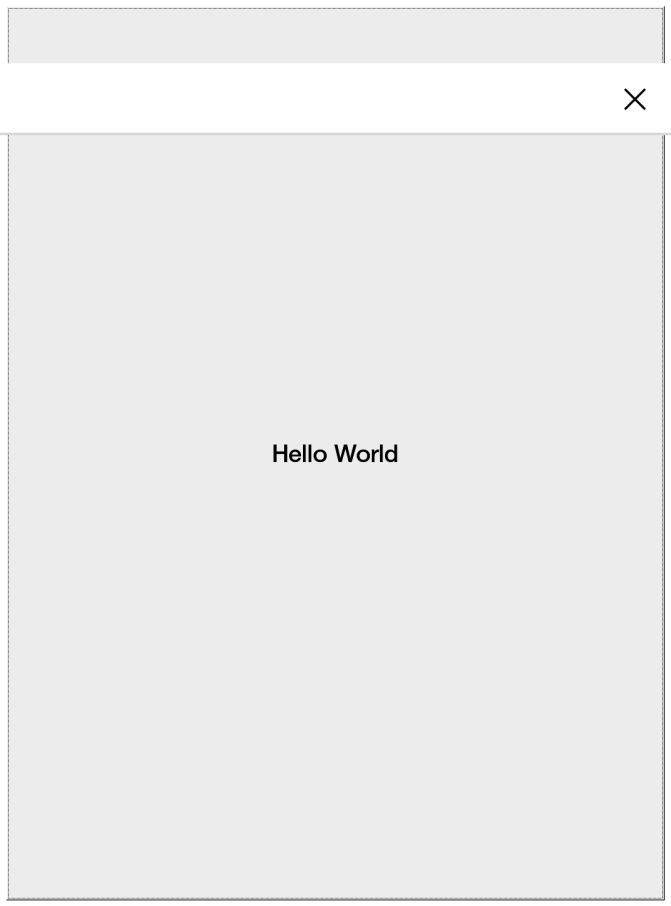
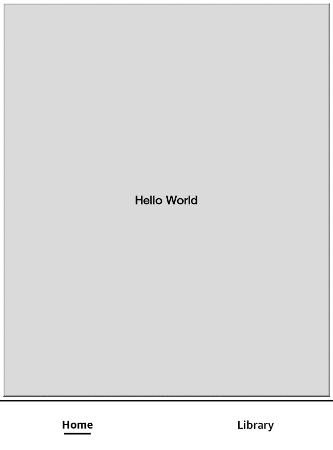
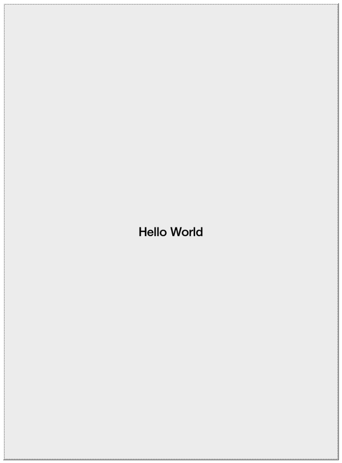
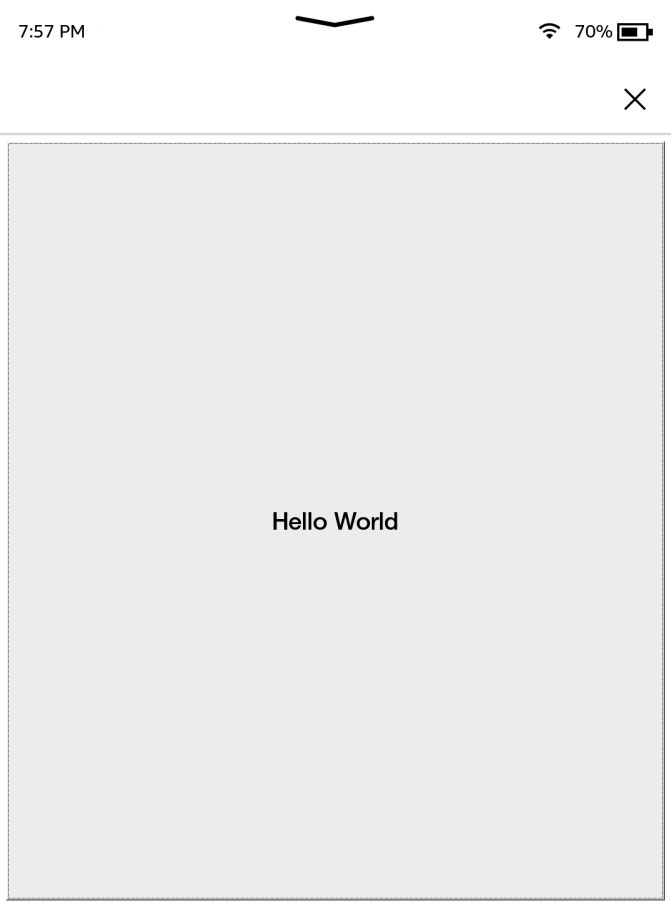
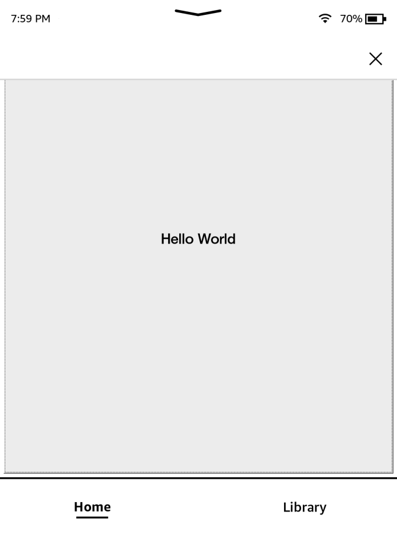

<style>
    img {
        max-height: 30vh;
        object-fit: scale-down;
    }
</style>

# Awesome Window Manager
As mentioned in the [gtk-tutorial](./gtk-tutorial/), the Kindle uses the `Awesome Window Manager` with some tweaks,this means that every window must have a title which follows a specific format.

For example, the Kindle store has a window title of:
```
L:A_N:application_PC:TS_ID:com.lab126.store
```

Window titles are actually a key-value store, seperated by an `_` character, this means the above title, would translate roughly to pseudo-JSON as:
```json
{
    "L":"A",
    "N":"application",
    "PC":"TS",
    "ID":"com.lab126.store"
}
```

Below is a list of every key and what it's role is:
## [L]ayer
The `L` flag is what layer the window should display on, it can be one of 5 values:

| Value | Description               |
|-------|---------------------------|
| `A`   | The `APP` layer           |
| `C`   | The `CHROME` layer        |
| `D`   | The `DIALOG` layer        |
| `KB`  | The `KB` (keyboard) layer |
| `SS`  | The `SCREENSAVER` layer   |

Layers are displayed from top to bottom, with applications on the `SCREENSAVER` layer being above applications on the `APP` layer.

Generally you will only be using the `A` and `D` layer values.


## [N]ame
lab126 internally refers to this as the "name/role" of the window, in reality it only represents the role of the window, and should be one of the listed values:

| Value          | Description                                                                                      |
|----------------|--------------------------------------------------------------------------------------------------|
| `application`  | For use with the `A` layer, application windows                                                  |
| `dialog`       | For use with the `D` layer, dialog windows                                                       |
| `titlebar`     | For backwards compatability,                                                                     |
| `tiledBottom`  | [SHOULD NOT BE USED IN PRODUCTION - lab_126.application_layer.lua:255]                           |
| `searchResult` | For use with the `C` layer, seemingly used for search result displays, acts as a modified dialog |
| `pillowAlert`  | An alert created by Pillow, for use with the `D` layer, blocks the home button                   |
| `titleBar`     |                                                                                                  |
| `footerBar`    |                                                                                                  |
| `topBar`       | Seemingly used for custom search bar apps (use with `BARTYPE` parameter)                         |
| `mediaBar`     |                                                                                                  |
| `bottomBar`    | REDUNDANT - use `topBar` role with `BARTYPE` of `B`                                              |
| `appToolBar`   | REDUNDANT - use `topBar` role with `BARTYPE` of `A`                                              |
| `keyboard`     | Used by the Kindle's keyboard                                                                    |
| `keyboardExt`  |                                                                                                  |
| `activeSS`     |                                                                                                  |
| `screenSaver`  |                                                                                                  |
| `searchBar`    | Used by the Kindle's top bar                                                                     |

You will generally only use `application` and `dialog` for this, in conjunction with the `A` and `D` layers


## [PC] (Persistent Chrome)

Used by the window manager to determines how to handle window displaying with the bar, the value it takes offsets the window size and position to ensure that particular chrome element can be displayed (hence the name).<br/>
It's value is any combination of the following:<br/>

| Value | Description                                                                                         | Example                        |
|-------|-----------------------------------------------------------------------------------------------------|--------------------------------|
| `T`   | Show the Kindle top bar/status bar on modern firmware                                               | |
| `S`   | Shows the "search bar"                                                                              | |
| `B`   | Shows the legacy bottom bar                                                                         | |
| `N`   | Show no bars                                                                                        | |

Omitting this is the same as `N`

Examples of multiple types:

| Value | Image                            |
|-------|----------------------------------|
| `TS`  |  |
| `TSB` | |


## [ID] (Identifier)
This is a simple string giving the identifier of the app, it's value can be anything not containing an underscore (as that is used as a delimiter) and it usually takes an app ID in a format similar to `com.lab126.reader` (reverse domain name)

Note that the value `blankBackground` is reserved, it's purpose is currently unknown but it makes an app `invalid`

## [BARTYPE]
BARTYPE is used with the`topBar` role type, it describes the bar's positioning and takes one of the following values:

| Value | Description                                                                                         |
|-------|-----------------------------------------------------------------------------------------------------|
| `T`   | Top bar type                                                                                        |
| `S`   | Search bar type                                                                                     |
| `B`   | Bottom bar type -  "added for kpp chrome footer" - It behaves like top bars in terms of persistence |
| `A`   | Application bar type - Secondary bar for application specific tools                                 |
| `TS`  |                                                                                                     |

## [O]rientation - Supported App Orientations
Sets the application's orientation mask for supported orientations, can be any combination of 4 values (IE: `ULR` or `UDLR`):

| Value | Description |
|-------|-------------|
| `U`   | Up          |
| `D`   | Down        |
| `L`   | Left        |
| `R`   | Right       |

## [HIDE]
A flag that can be set to hide the window, the title can be updated without it to show the window

IE:
```
L:A_N:application_HIDE_ID:org.kindlemodding.hiddenwindow
```

Note that this flag can take an optional value of `background` which means this window does not take focus. (actual purpose unknown)

## [RC] - Rounded Corners
For use with dialogs, can be used to set rounded corners on a dialog, it can be used as a flag or given an integer value representing the corner radius in pixels of all the corners.

It can also be given the value `custom`, where any combination of the following 4 keys can be used to set a corner radius for the window:
- `RCTL`
- `RCTR`
- `RCBL`
- `RCBR`

Example, setting rounded corners only on the top-left and top-right corners to the default rounded corner radius:
```
RC:custom_RCTL_RCTR
```

## [M]odality
Used specifically for dialogs, if this flag is present, it dictates the dialog is a modal.
It can have an optional value of `dismissible`, ie:
```
L:A_N:application_M:dismissable_ID:org.kindlemodding.hiddenwindow
```

## [RKB] - Require KeyBoard
Used specifically for dialogs that require the keyboard, this positions the dialog so that it does not clip with the spawned keyboard.
It can seemingly take a numeric value of unknown purpose.

## [PALMR] - Palm Rejection
Purpose unknown - only used in conjunction with `M:dismissable`, seemingly related to palm rejection on dismissal

