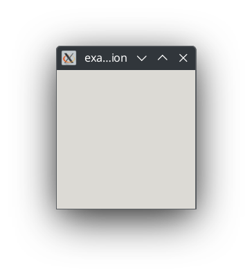

# Setting Up The Project
Create a new git repository in a safe location, this will be where we write the code for our app

## Setting up the Meson project
### Creating the meson.options file
Create a file called `meson.options` and copy the following to it:<br/>

```python
option('kindle_root_dir', type : 'string', value: '', description: 'The path to the Kindle\'s mounted rootfs (for linking libraries)')
```
<br/>

The [`meson.options`](https://mesonbuild.com/Build-options.html) file tells Meson what parameters a project uses for configuration and compilation, in our case we only need the `kindle_root_dir` option so we can set it to our Kindle's root directory in a later step.

### Creating the meson.build file
The `meson.build` file specifies how our project is configured and compiled.<br/>
Create a `meson.build` file and copy the following to it:
```python
project('example_gtk_application', 'cpp', version: 'v1.0.0', default_options: ['cpp_std=c++17'], meson_version: '>=1.1')

# Define dependencies we want
gtk_dep = dependency('gtk+-2.0')

###
# Project definition
###
sources = files(
    './src/main.cpp'
)

include_dirs = include_directories(
  './src/include/'
)

executable('example_gtk_application', sources, include_directories: include_dirs, dependencies: [gtk_dep], cpp_args: '-static-libstdc++', link_args: '-static-libstdc++')
```

Note how we statically link the C++ standard library! Koxtoolchain ships with a GCC version newer than the Kindle technically supports, but this is fine so long as we statically link the standard library.

Your overall file structure should now look something like this:
```
.
├── meson.build
└── meson.options

1 directory, 2 files
```

## Creating our source files
Now create a file called `main.cpp` and a folder called `include` under the `src/` folder, your overall file structure should look something like:

```
.
├── meson.build
├── meson.options
└── src
    ├── include
    └── main.cpp

3 directories, 3 files
```

Now in `main.cpp`, copy the following code:
```cpp
#include <gtk/gtk.h>

int main(int argc, char* argv[]) {
  GtkWidget *window;
    
  gtk_init (&argc, &argv);
  
  window = gtk_window_new (GTK_WINDOW_TOPLEVEL);
  gtk_widget_show  (window);
  
  gtk_main();

  return 0;
}
```

## Testing compilation
Now we will use meson to make sure we can actually compile our code for both our computer and our target

Configure the Meson project for your computer as so:
```sh
meson setup builddir
```

Now we can try to compile our program
```sh
meson compile -C builddir
```

If you run the program on your computer, you should see an empty GTK window:
