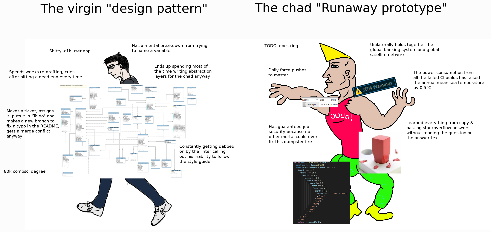

# Kindle OS

As many Kindle developers are aware, the Kindle's OS is a mess of Java, Javascript, Lua, Native and React Native code.
Due to its complexity, there hasn't been any exhaustive documentation on its working, that is what this section aims to do.

The Kindle runs stripped down Linux with a React Native frontend along with Java backend applications.